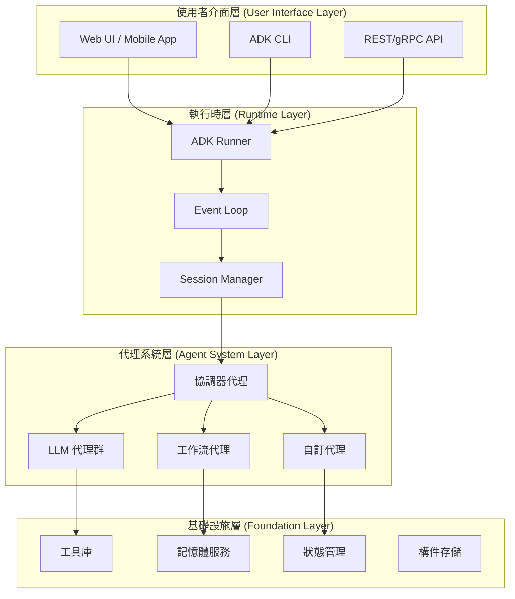
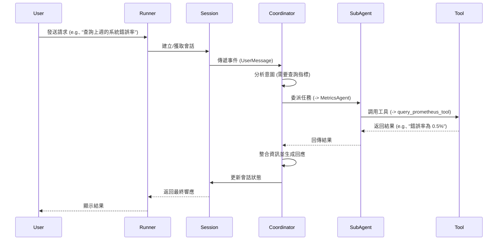

# Google ADK 多代理系統專案架構文件 v1.0

## 文件資訊
- **版本**: 1.0.0
- **日期**: 2025-08-27
- **作者**: Jules, ADK 架構團隊
- **文件類型**: 技術架構規範書
- **適用框架**: Google Agent Development Kit (ADK)

---

## 0. 引言 (Introduction)

本文件旨在提供一份全面且深入的 Google Agent Development Kit (ADK) 專案架構指南。作為一份標準技術範本，本文詳細闡述了 ADK 的核心概念、組件、消息傳遞機制、代理層次結構、部署策略、測試與評估方法，以及開發與調試工具。

本文件的目標是為所有團隊成員提供清晰的技術棧、運作流程、整體生命週期和完整閉環的理解，確保在建構多代理系統 (Multi-Agentic System) 時有一致的方向與高品質的實踐。

---

## 1. 系統總覽與核心概念 (System Overview & Core Concepts)

### 1.1 架構背景與目標

Google Agent Development Kit (ADK) 是一個彈性且模組化的框架，專為開發和部署 AI 代理而設計。本架構文件提供標準化的系統設計模板，確保團隊能夠：

- **建構可擴展的多代理系統**：支援複雜任務分解與協作。
- **實現生產級部署**：從本地開發到雲端規模化部署。
- **維護系統可觀測性**：完整的追蹤、監控與評估機制。
- **確保安全合規**：內建安全防護與稽核能力。

### 1.2 適用業務場景

- **對話式 AI 助理**：客服、技術支援、個人助理。
- **工作流自動化**：文件處理、數據分析、報告生成。
- **多模態應用**：即時音視頻互動、圖像分析。
- **企業級整合**：CRM、ERP、SRE 維運、知識庫系統對接。

### 1.3 高階架構圖

ADK 架構主要分為四個層次，從使用者介面到基礎設施，形成一個完整的技術堆疊。




### 1.4 核心概念 (Core Concepts)

- **Agent (代理)**: ADK 中最基本的工作單元，專為特定任務設計。
- **Tool (工具)**: 賦予代理與外部世界互動的能力，如 API 調用、資料庫查詢。
- **Runner (運行器)**: 執行引擎，協調「推理-行動」循環，管理 LLM 調用與工具執行。
- **Session (會話)**: 管理單次對話的上下文，包括歷史事件 (`Events`) 和工作記憶 (`State`)。
- **Memory (記憶)**: 使代理能夠跨會話回憶信息，提供長期上下文。
- **Events (事件)**: 基本的通信單元，代表會話期間發生的所有事情，形成可追蹤的歷史記錄。
- **Artifacts (構件)**: 允許代理管理與任務相關的非文本數據，如文件、圖片。

---

## 2. 組件設計 (Component Architecture)

### 2.1 Agent (代理) 角色定義與分工

#### 2.1.1 代理類型定義

| 代理類型 | 用途 | 核心屬性 | 實作範例 |
|---|---|---|---|
| **LlmAgent** | 語言理解與推理 | `model`, `instructions`, `tools` | 客服對話、內容生成 |
| **SequentialAgent** | 順序執行工作流 | `sub_agents`, `execution_order` | 多步驟表單處理 |
| **ParallelAgent** | 並行任務處理 | `sub_agents`, `max_concurrency` | 多源數據聚合 |
| **LoopAgent** | 迭代優化流程 | `sub_agents`, `max_iterations`, `exit_condition` | 程式碼重構、內容精煉 |
| **CustomAgent** | 特定業務邏輯 | 繼承 `BaseAgent` | 資料驗證、規則引擎 |

#### 2.1.2 代理配置範例

```python
# LlmAgent 配置範例
from google.adk.agents import LlmAgent
from google.genai import GenerationConfig, SafetySetting

coordinator = LlmAgent(
    name="MainCoordinator",
    model="gemini-1.5-flash",
    description="主協調器，負責任務分派與結果整合",
    instructions="""
    你是一個智慧任務協調器，負責：
    1. 分析使用者請求的意圖和複雜度。
    2. 將任務分配給適當的專業代理。
    3. 整合各代理的執行結果。
    4. 確保回應的完整性和一致性。
    """,
    tools=[search_tool, calculator_tool],
    safety_settings=[
        SafetySetting(
            category="HARM_CATEGORY_DANGEROUS_CONTENT",
            threshold="BLOCK_MEDIUM_AND_ABOVE"
        )
    ],
    generate_content_config=GenerationConfig(
        temperature=0.7,
        max_output_tokens=2048,
        top_p=0.95
    )
)
```

### 2.2 Tool (工具) 種類與協作方式

#### 2.2.1 工具分類架構

```python
# 工具註冊表結構
tool_registry = {
    # 功能型工具
    "function_tools": [
        FunctionTool(get_weather, description="獲取天氣資訊"),
        FunctionTool(search_database, description="搜尋知識庫")
    ],
    # 代理工具（將代理作為工具）
    "agent_tools": [
        AgentTool(data_analyst_agent, description="數據分析專家"),
        AgentTool(code_generator_agent, description="程式碼生成器")
    ],
    # 長時運行工具
    "long_running_tools": [
        LongRunningFunctionTool(
            human_approval_workflow,
            description="需要人工審核的操作"
        )
    ]
}
```

### 2.3 核心組件互動序列圖



---

## 3. 多代理協作與通訊 (Multi-Agent Collaboration & Messaging)

### 3.1 多代理分層架構與模式

- **Orchestrator-Worker (編排器-工作者模式)**: 一個元代理負責分解任務並路由給專職代理。
- **Sequential & Parallel (循序與並行模式)**: `Workflow Agents` 按順序或並發執行獨立子任務。
- **Hierarchical Decomposition (層級分解)**: 將一個複雜問題逐層分解給不同層級的代理處理。

### 3.2 Agent-to-Agent (A2A) 通訊協定

| 機制 | 描述 | 使用場景 | 實作方式 |
|---|---|---|---|
| **共享狀態** | 透過 `session.state` 傳遞資料 | 簡單數據交換 | `context.state['shared_key'] = value` |
| **LLM 驅動轉移** | 使用 `transfer_to_agent` 動態委派 | 動態任務委派 | `transfer_to_agent(agent_name='ExpertAgent')` |
| **顯式調用** | 將代理封裝為 `AgentTool` | 明確的功能調用 | `AgentTool(sub_agent)` |
| **事件驅動** | 發布/訂閱模式，監聽事件 | 異步協作 | `event_bus.publish('event_name', data)` |

### 3.3 工作流設計模式

#### 3.3.1 協調器/分派器模式

```python
# Coordinator/Dispatcher Pattern
dispatcher = LlmAgent(
    name="IntelligentDispatcher",
    instruction="""
    根據請求類型分派到適當代理：
    - 技術問題 -> TechnicalAgent
    - 帳務問題 -> BillingAgent
    """,
    sub_agents=[technical_agent, billing_agent]
)
```

#### 3.3.2 MapReduce 模式

```python
# 並行處理後聚合
map_phase = ParallelAgent(
    name="DataMappers",
    sub_agents=[
        LlmAgent(name="Mapper1", output_key="result1"),
        LlmAgent(name="Mapper2", output_key="result2")
    ]
)

reduce_phase = LlmAgent(
    name="Reducer",
    instruction="整合 {result1} 和 {result2} 的分析結果"
)

mapreduce_workflow = SequentialAgent(
    name="MapReduceWorkflow",
    sub_agents=[map_phase, reduce_phase]
)
```

---

## 4. 工具與外部服務整合 (Tooling & External Integration)

### 4.1 工具註冊與管理

所有工具應在一個集中的註冊表 (e.g., `tool_registry.py`) 中定義，並使用 `FunctionTool` 進行標準化封裝。

```python
from typing import Annotated
from google.adk.tools import FunctionTool

@FunctionTool
def query_metrics(
    metric_name: Annotated[str, "指標名稱，如 cpu_usage"],
    time_range: Annotated[str, "時間範圍，如 1h, 24h"] = "1h"
) -> dict:
    """查詢系統監控指標"""
    # 實際的 API 調用邏輯
    return {"metric": metric_name, "value": 75.5}
```

### 4.2 外部服務整合模式

通過為外部服務 (如 Grafana, Prometheus API) 編寫包裝函數並用 `@FunctionTool` 裝飾，可以輕鬆將其整合為 ADK 工具。

### 4.3 安全控管機制

- **憑證管理**: API Key 和其他敏感憑證應通過安全的秘密管理服務 (如 Google Secret Manager) 傳遞，絕不硬編碼。
- **權限控制**: 可使用 `before_tool_callback` 回調函數來實現對工具執行的細粒度權限檢查。

---

## 5. 工作流與事件處理 (Workflow & Event Handling)

### 5.1 事件驅動架構

ADK 的執行是事件驅動的。`Runner` 在每個步驟都會發出事件，如 `before/after_model_callback`, `before/after_tool_callback`。開發者可以註冊回調函數來監聽這些事件，以實現日誌記錄、監控、錯誤處理等自訂邏輯。

### 5.2 工作流代理設計

#### 5.2.1 順序執行工作流

```python
validation_workflow = SequentialAgent(
    name="ValidationPipeline",
    sub_agents=[
        LlmAgent(name="DataValidator"),
        LlmAgent(name="BusinessRuleChecker")
    ],
    error_handling={"on_error": "stop", "max_retries": 3}
)
```

#### 5.2.2 並行執行工作流

```python
parallel_analysis = ParallelAgent(
    name="MultiSourceAnalysis",
    sub_agents=[
        LlmAgent(name="DatabaseAnalyzer"),
        LlmAgent(name="LogAnalyzer")
    ],
    execution_config={"timeout_seconds": 60, "fail_fast": False}
)
```

#### 5.2.3 循環優化工作流

```python
refinement_loop = LoopAgent(
    name="ContentRefinement",
    sub_agents=[
        LlmAgent(name="ContentGenerator"),
        LlmAgent(name="QualityChecker")
    ],
    loop_config={
        "max_iterations": 5,
        "exit_condition": lambda state: state.get("quality_score", 0) >= 0.9
    }
)
```

---

## 6. 記憶體架構與知識管理 (Memory & Knowledge Management)

### 6.1 記憶體層級設計

| 記憶體類型 | 範圍 | 生命週期 | 使用場景 |
|---|---|---|---|
| **Temp State** | 單次調用 | 立即清除 | 臨時計算結果 |
| **Session State** | 會話期間 | 會話結束清除 | 對話上下文 |
| **User Memory** | 跨會話用戶 | 持久化 | 用戶偏好設定 |
| **App Memory** | 應用全域 | 持久化 | 共享知識庫 |

### 6.2 知識檢索 (RAG)

通過整合向量數據庫 (如 Vertex AI Search) 實現檢索增強生成 (RAG)，是擴展代理知識的關鍵。

```python
from google.adk.memory import VertexAiRagMemoryService

# 配置向量搜索服務
memory_service = VertexAiRagMemoryService(
    project_id="your-project-id",
    corpus_id="knowledge-corpus"
)

# 知識檢索工具
@FunctionTool
async def search_knowledge(query: str) -> str:
    """從知識庫檢索相關資訊"""
    results = await memory_service.search_memory(query=query)
    return results.documents[0].content
```

### 6.3 記憶體持久化策略

在生產環境中，應使用持久化的 `SessionService`，如 `DatabaseSessionService`，以支持多實例部署和故障恢復。

---

## 7. 部署架構與伸縮性 (Deployment & Scalability)

### 7.1 部署架構藍圖

ADK 應用被設計為無狀態的，易於容器化 (Docker) 並部署到雲端平台。

- **推薦平台**:
  - **Google Cloud Run**: 用於無伺服器、自動擴展的部署。
  - **Google Kubernetes Engine (GKE)**: 用於需要複雜網路和協調的場景。

### 7.2 部署配置範例

```dockerfile
# Dockerfile
FROM python:3.11-slim
WORKDIR /app
COPY requirements.txt .
RUN pip install --no-cache-dir -r requirements.txt
COPY . .
CMD ["python", "-m", "google.adk.api_server", "--host", "0.0.0.0", "--port", "8080"]
```

### 7.3 版本管理與升級策略

- **版本控制**: 使用 Git 進行原始碼版本控制，並使用容器映像檔標籤管理部署版本。
- **升級策略**: 推薦使用藍綠部署 (Blue-Green Deployment) 或金絲雀發布 (Canary Release) 策略，以實現平滑升級和快速回滾。

---

## 8. 監控、測試與評估 (Observability, Testing & Evaluation)

### 8.1 監控指標體系 (Observability)

- **整合**: ADK 可與 OpenTelemetry 整合，將日誌、指標和追蹤導出到監控系統 (如 Google Cloud Operations Suite)。
- **關鍵指標**:
  - **延遲 (Latency)**: 代理回應時間、工具調用時間。
  - **成本 (Cost)**: LLM Token 使用量。
  - **品質 (Quality)**: 錯誤率、工具調用成功率、用戶滿意度。

### 8.2 測試框架整合

- **單元測試 (`pytest`)**: 測試單個工具函數的確定性邏輯。
- **整合測試 (`pytest`)**: 測試代理與工具的交互，通常需要模擬 LLM。
- **端到端評估**: 評估與真實 LLM 的交互品質。

### 8.3 評估管道配置

ADK 提供 `AgentEvaluator` 框架，用於在「金標」測試集上評估代理表現。

```python
# 評估配置
from google.adk.evaluation import EvaluationFramework

evaluation_config = {
    "datasets": [{"name": "sre_incidents", "path": "data/eval/sre.jsonl"}],
    "evaluators": [
        {
            "type": "llm_judge",
            "model": "gemini-1.5-flash",
            "criteria": {"accuracy": "診斷是否準確", "helpfulness": "建議是否有效"}
        },
        {
            "type": "trajectory_evaluator",
            "checks": ["no_unnecessary_tool_calls", "state_consistency"]
        }
    ]
}
```

---

## 9. 安全性與合規 (Security & Compliance)

### 9.1 權限管理架構 (RBAC)

- **最小權限原則**: 每個代理應僅被授予完成其任務所必需的工具和權限。
- **基於角色的訪問控制 (RBAC)**: 根據用戶角色動態提供工具和代理訪問權限。

### 9.2 資料保護與加密

- **敏感資訊處理**: 利用回調函數過濾或遮罩進出 LLM 的敏感數據 (PII)。
- **加密**: 對持久化儲存的敏感數據（如用戶記憶）進行加密。

### 9.3 審計與合規追蹤

- **日誌記錄**: 使用結構化日誌記錄所有關鍵操作，包括代理決策、工具調用和狀態變更。
- **追蹤**: 利用 OpenTelemetry 為所有請求提供端到端的追蹤，便於審計和故障排除。

---

## 10. 系統維運與文件管理 (Operations & Documentation)

### 10.1 標準作業程序 (SOP)

- **部署流程**: 建立包含前置檢查、部署步驟和後置驗證的標準部署流程。
- **故障排除**: 建立常見問題的故障排除指南和緊急應變流程。

### 10.2 文件管理

- **架構文件**: 本文件作為核心設計文檔，應隨專案演進持續更新。
- **程式碼即文件**: 確保所有代理和工具的 `description` 和 `docstrings` 清晰、準確，因為它們直接影響 LLM 的行為。

---

## 附錄 A：核心 API 介面設計

### A.1 Agent 基礎介面

```python
from abc import ABC, abstractmethod

class BaseAgent(ABC):
    """所有代理的基礎介面"""
    @abstractmethod
    async def _run_async_impl(self, context, input_text: str) -> str:
        pass
```

### A.2 Event 格式規範

```json
{
  "event_id": "evt_123",
  "type": "agent_response",
  "timestamp": 1704067200.123,
  "correlation_id": "corr_abc",
  "source": {"type": "agent", "name": "Coordinator"},
  "payload": {"message": "Process this data"},
  "metadata": {"session_id": "sess_xyz", "trace_id": "trace_def"}
}
```

---

## 附錄 B：最佳實踐與設計模式

### B.1 代理設計原則

1.  **單一職責原則**: 每個代理專注於特定領域或任務。
2.  **介面隔離**: 代理間通過明確定義的介面通訊。
3.  **無狀態設計**: 代理本身應是無狀態的，所有上下文通過 `Session` 傳遞。

### B.2 常見反模式與解決方案

| 反模式 | 問題 | 解決方案 |
|---|---|---|
| **超級代理** | 單一代理承擔過多職責，難以維護 | 拆分為多個專門代理，使用協調器模式 |
| **緊密耦合** | 代理間直接依賴實作細節 | 使用事件驅動或共享狀態進行通訊 |
| **無限循環** | 代理間循環調用導致死循環 | 在 `LoopAgent` 中設置最大迭代次數和退出條件 |

---

## 附錄 C：參考資源

- [ADK 官方文檔](https://google.github.io/adk-docs/)
- [ADK Codelabs 教學](https://codelabs.developers.google.com/instavibe-adk-multi-agents/instructions)
- [ADK GitHub 倉庫](https://github.com/google/adk-python)
- [Agent Starter Pack](https://github.com/GoogleCloudPlatform/agent-starter-pack)
- [A2A 協定規範](https://a2aprotocol.ai/)

---

## 版本歷史

| 版本 | 日期 | 變更說明 |
|---|---|---|
| 1.0.0 | 2025-08-26 | 初始草案 |
| 2.0.0 | 2025-08-27 | 根據多個參考範本進行綜合與擴充，形成標準架構文件 |