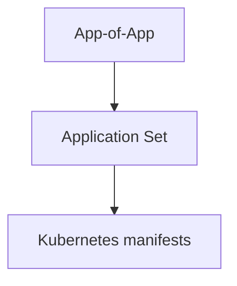

# 如何使用 Application Sets 來組織您的 Argo CD 儲存庫

1.  **Argo CD 應用程式清單 (manifests) 的存放位置**
2.  **如何與多個團隊、叢集及應用程式協作**
3.  **如何運用 ApplicationSets 簡化管理**
4.  **如何拆分您的 GitOps 儲存庫，而非使用單體儲存庫 (monorepo)**

---

## 不同類型的 Manifests

| 分類 | 描述 | 類型 | 變更頻率 | 目標使用者 |
| :--- | :--- | :--- | :--- | :--- |
| 1 | 開發者 Kubernetes Manifests | Helm、Kustomize 或純 manifests in Git | 非常頻繁 | 主要為開發者 |
| 2 | 開發者 Argo CD Manifests | Argo CD app 和 Application Set | 幾乎不變 | 維運人員/開發者 |
| 3 | 基礎設施 Kubernetes Manifests | 通常是外部 Helm charts (在 Git 或 Helm repo 中) | 有時 | 維運人員 |
| 4 | 基礎設施 Argo CD Manifests | Argo CD app 和 Application Set | 幾乎不變 | 維運人員 |

**第一類**是標準的 Kubernetes 資源（Deployment、Service、Ingress、Config、Secrets 等），由任何 Kubernetes 叢集定義。這些資源與 Argo CD 無關，基本上描述了一個應用程式如何在 Kubernetes 內部運行。開發者可以使用這些資源在一個完全沒有 Argo CD 的本地叢集中安裝應用程式。這些 manifests 變更非常頻繁，因為您的開發者會部署新版本，通常透過以下方式持續更新：

1.  更新 deployment manifest 中的容器映像版本（約 80% 的情況）。
2.  更新容器映像及 configmap 或 secret 中的某些設定（約 15% 的情況）。
3.  僅更新設定以微調業務或技術屬性（約 5% 的情況）。

**第二類**是 Argo CD 應用程式 manifests。這些基本上是策略設定，參考了應用程式的真實來源（第一種類型的 manifests）以及該應用程式的目標和同步策略。請記住，一個 Argo CD 應用程式的核心是一個非常簡單的連結，它連接了一個 Git 儲存庫（包含標準 Kubernetes manifests）和一個目標叢集。


與普遍看法相反，開發者不希望被這種類型的 manifests 所困擾。即使對於維運人員來說，這種類型的 manifest 也應該是設定一次後就無需再理會的東西。Application Set manifests 也屬於同一類別。

**第三類和第四類**與第一類和第二類相同，但這次我們談論的是基礎設施應用程式（cert manager、nginx、coredns、prometheus 等），而不是由您的開發者創建的內部應用程式。

請注意，對於這些 manifests，可以使用與開發者應用程式不同的範本系統。例如，一個非常流行的模式是為現成的應用程式使用 Helm，而為您的開發者創建的應用程式選擇 Kustomize。

我們將簡要討論這兩種類型的 manifests（第三類和第四類），但本文的重點是前兩類。原因如下：

*   開發者不關心基礎設施 manifests。
*   這些 manifests 不會經常變更。通常只在升級相關組件或微調參數時才會變更。

這裡的關鍵點是，這 4 種類型的 manifests 在多個方面有不同的要求，例如目標受眾，以及最重要的變更頻率。當我們談論「GitOps 儲存庫結構」時，您應該總是從解釋我們正在討論哪一類 manifests 開始（如果不只一類）。

## 反模式 1 – 混合不同類型的 Manifests

在解釋最佳實踐之前，重要的是要警告一些反模式，這些想法在開始時看起來不錯，但長遠來看會使事情變得複雜。

您的 manifests 的一個關鍵點是要在 Kubernetes 資源（第一類）和 Argo CD 資源（第二類）之間有非常明確的分離。為方便起見，Argo CD 有幾個功能允許您混合這兩類。儘管在某些特殊情況下這是必要的，但我們建議**不要混合不同類型的 manifests**。

舉個簡單的例子，Argo CD 支援以下 Helm 應用的語法：

```yaml
apiVersion: argoproj.io/v1alpha1
kind: Application
metadata:
  name: my-helm-override
  namespace: argocd
spec:
  project: default

  source:
    repoURL: https://github.com/example-org/example-repo.git
    targetRevision: HEAD
    path: my-chart

    helm:
      # 不要這樣做
      parameters:
      - name: "my-example-setting-1"
        value: my-value1
      - name: "my-example-setting-2"
        value: "my-value2"
        forceString: true # 確保 value 被視為字串

      # 不要這樣做
      values: |
        ingress:
          enabled: true
          path: /
          hosts:
            - mydomain.example.com

      # 不要這樣做
      valuesObject:
        image:
          repository: docker.io/example/my-app
          tag: 0.1
          pullPolicy: IfNotPresent
  destination:
    server: https://kubernetes.default.svc
    namespace: my-app
```

這個 manifest 集兩種功能於一身。主文件是關於 Argo app（第二類），但 `helm` 屬性實際上包含了 Kubernetes 應用程式（第一類）的值。

這個 manifest 可以很容易地修正，只需將所有參數放入與 chart 相同的 Git 儲存庫中的 `values` 文件即可：

```yaml
apiVersion: argoproj.io/v1alpha1
kind: Application
metadata:
  name: my-helm-override
  namespace: argocd
spec:
  project: default

  source:
    repoURL: https://github.com/example-org/example-repo.git
    targetRevision: HEAD
    path: my-chart

    helm:
      ## 這樣做 (values 在 Git 中獨立存在)
      valueFiles:
      - values-production.yaml
  destination:
    server: https://kubernetes.default.svc
    namespace: my-app
```

還有一種情況是使用 [Helm Umbrella charts](https://codefresh.io/blog/simplify-kubernetes-helm-deployments/)，它允許您既引用其他 charts，又覆寫它們的特定值。

使用外部 charts（即未儲存在 Git 中）也是可能的，但這不是我們推薦的方法。從第三方來源使用外部 charts 會帶來安全性和穩定性方面的許多挑戰。

理想情況下，您所有的 Helm charts 都應在您的控制之下並儲存在 Git 中，這樣您就可以獲得 GitOps 的所有好處。

```yaml
apiVersion: argoproj.io/v1alpha1
kind: Application
metadata:
  name: my-proper-helm-app
  namespace: argocd
spec:
  sources:
  - repoURL: 'https://my-chart/helm-charts'
    chart: my-helm-chart
    targetRevision: 3.7.1
    helm:
      valueFiles:
      - $values/my-chart-values/values-prod.yaml
    ## 這樣做 (values 在 Git 中獨立存在)
  - repoURL: 'https://git.example.com/org/value-files.git'
    targetRevision: dev
    ref: values
  destination:
    server: https://kubernetes.default.svc
    namespace: my-app
```

同樣地，Argo CD 也支援以下方式：

```yaml
apiVersion: argoproj.io/v1alpha1
kind: Application
metadata:
  name: my-kustomize-override
  namespace: argocd
spec:
  source:
    repoURL: https://github.com/example-org/example-repo.git
    targetRevision: HEAD
    path: my-app

    # 不要這樣做
    kustomize:
      namePrefix: prod-
      images:
      - docker.io/example/my-app:0.2
      namespace: custom-namespace

  destination:
    server: https://kubernetes.default.svc
    namespace: my-app
```

這裡，來自 Kustomize 的屬性（第一類）再次與主 Application manifest（第二類）混合。為避免這種情況，您應該將 Kustomize 的值另存為一個 overlay，而不是將它們硬編碼在 Application CRD 中：

```yaml
apiVersion: argoproj.io/v1alpha1
kind: Application
metadata:
  name: my-proper-kustomize-app
  namespace: argocd
spec:
  source:
    repoURL: https://github.com/example-org/example-repo.git
    targetRevision: HEAD
    ## 這樣做。將所有值儲存在 Kustomize Overlay 本身
    path: my-app/overlays/prod

  destination:
    server: https://kubernetes.default.svc
    namespace: my-app
```

要判斷您的 manifests 是否劃分正確，可以問自己以下問題：

> 「如果一個開發者是 Kubernetes 資源的專家，但對 Argo CD 一無所知，他們是否仍然可以使用 kustomize（或 Helm）在本地筆記型電腦上安裝應用程式？」

如果答案是「否」，那麼您需要找出 Kubernetes manifests 「滲透」到 Argo CD 應用程式的地方，並解除這種緊密耦合。

我見過許多組織不幸地陷入混合 manifests 的陷阱，幾乎每次與他們討論時，他們都認為這種方法是「必需的」，因為他們從未理解底層工具（Helm/Kustomize）的功能。

如果您的組織使用 Helm，請確保您了解 Helm 的值層級結構 (value hierarchies) 和 Helm umbrella charts 的運作方式。您可以透過精心設計的 Helm 值層級結構來涵蓋大多數典型場景。只有在別無選擇時，才使用 Argo CD 的[多來源](https://argo-cd.readthedocs.io/en/latest/user-guide/multiple_sources/)功能。並記住，它目前處於 Beta 階段。

如果您的組織使用 Kustomize，請確保您了解[元件 (components)](https://kubectl.docs.kubernetes.io/guides/config_management/components/)（可重用區塊）的運作方式，以及各種[轉換器/補丁/替換 (transformers/patches/replacements)](https://kubectl.docs.kubernetes.io/references/kustomize/kustomization/replacements/)。

將這兩種類型的 manifests 分開是一個很好的做法，正如您在後續章節中所見，但從上一節的表格中可以明顯看出，混合具有不同生命週期的事物總會帶來麻煩。

混合不同類型的 manifests 會帶來幾個挑戰：

*   使 manifests 對所有相關方都更難理解。
*   混淆了使用 manifests 的人（例如開發者）和創建 manifests 的人（例如管理員/維運人員）的要求。
*   將您的 manifests 與特定的 Argo CD 功能耦合。
*   使分離安全考量變得更加複雜。
*   導致更多的活動部件和難以除錯的場景。
*   使開發者的本地測試變得更加困難。

**注意**：另一個您**不應該**使用的 Argo CD 功能是[參數覆寫 (parameter overrides)](https://argo-cd.readthedocs.io/en/stable/user-guide/parameters/)。在最原始的形式中，它們甚至不遵循 GitOps 原則。即使您將它們保存在 Git 中，您仍然在同一個地方混合了 Argo CD 和 Kubernetes 的資訊（混合了第一類和第二類的資訊）。

## 反模式 2 – 在錯誤的抽象層級工作

Argo CD application CRD 的目的是作為主要 Kubernetes manifests 的「包裝器」或「指標」。重要的是 Kubernetes manifests（第一類），而 Argo CD manifests（第二類）應該始終扮演輔助角色。

在理想情況下，您應該只創建一次 Application manifest，以定義哪個 Git 儲存庫對應哪個叢集，然後再也不碰這個文件（這就是為什麼在前面的表格中，變更頻率是「幾乎不變」）。

不幸的是，我們看到許多公司將 Application CRD 作為其主要工作單元，而不是實際的 Kubernetes manifests。

典型的例子是，他們使用 CI 流程自動更新 Application 中的 `targetRevision`（或 `path`）欄位。

```yaml
apiVersion: argoproj.io/v1alpha1
kind: Application
metadata:
  ## 不要這樣做
  name: my-ever-changing-app
  namespace: argocd
spec:
  project: default
  source:
    repoURL: https://github.com/example-org/example-repo.git
    targetRevision: dev
    ## 之前是 "targetRevision: staging"，再之前是 "targetRevision: 1.0.0",
    ## 更早之前是 "targetRevision: 1.0.0-rc"
    path: my-staging-app
    ## 之前是 "path: my-qa-app"
  destination:
    server: https://kubernetes.default.svc
    namespace: my-app
```

將 Application CRD 視為一個 Kubernetes 資訊清單的「包裝器」或「指標」，這實質上意味著存在幾個潛在問題和不良實踐。例如，持續將 `targetRevision` 欄位指向不同的分支，幾乎總是意味著該組織正在「使用分支」來區分環境，我們強烈反對這種做法。

這也意味著，僅僅查看一個 Git 儲存庫本身並不能清楚地表明期望的狀態是什麼，相反，每個應用程式都可以有自己獨立的 `targetRevision`，需要被理解並與另一個 Git 儲存庫進行比較才能了解全貌。

一個 Argo CD 應用程式**不是**一個可用於運行任意應用的可重用盒子。GitOps 的全部意義在於為應用程式的行為提供清晰的事件歷史。但如果您將 application CRD 視為一個通用的工作單元，可以指向完全不同的 manifests，您就失去了 GitOps 的主要好處之一。

同樣，在大多數情況下，您應該更改底層的 Kubernetes manifests 本身，而不是 CRD。例如，與其將 `targetRevision` 欄位更改為包含應用程式新映像的分支，您應該直接在 Argo CRD 指向的 Kubernetes deployment 資源中更改應用程式映像。

## 反模式 3 – 在不同/多個層級使用範本化

與前一個反模式密切相關的是在 Application CRD（第二類）上應用範本化功能。Helm 和 Kustomize 已經是非常強大的工具，可以涵蓋大多數對主要 Kubernetes manifests（第一類）進行範本化的情況。

問題始於人們試圖對 Application CRD 進行範本化，因為他們試圖解決由前一個反模式所創造的問題。

這裡的典型例子是，一個團隊創建了一個包含 Application CRD 的 Helm chart，而這些 CRD 本身又指向 Kubernetes manifests 的 Helm charts。所以現在您試圖在兩個不同的層級上同時應用 Helm 範本。隨著您的 Argo CD 使用範圍擴大，新來者很難理解您的 manifests 是如何結構化的。

Argo CD 沒有為範本化 Application CRD 提供強大的範本機制，這一事實應該是一個強烈的暗示，表明這**不是**我們推薦的工作流程。隨著 ApplicationSets（見下點）的引入，應用範本化的正確位置是在 ApplicationSet 上，而不是在單個 Application 文件上。

## 反模式 4 – 不使用 Application Sets

我們已經談了很多關於 Application manifests（第二類）以及不應該如何處理它們。這是本文的主要轉折點。理想情況下，您根本**不需要**創建 Application CRD

Application Sets 可以為您處理所有應用程式 manifests（第二類）的創建。例如，如果您有 20 個應用程式和 5 個叢集，您可以擁有一個**單一的** application set 文件，它將自動生成您 Argo CD 應用程式的 100 種組合。

這是一個取自 [GitOps 認證](https://learning.codefresh.io/)的例子：

```yaml
apiVersion: argoproj.io/v1alpha1
kind: ApplicationSet
metadata:
  name: cluster-git
spec:
  generators:
    # matrix 'parent' generator
    - matrix:
        generators:
          # Git generator, 'child' #1
          - git:
              repoURL: https://github.com/codefresh-contrib/gitops-cert-level-2-examples.git
              revision: HEAD
              directories:
                - path: application-sets/example-apps/*
          # cluster generator, 'child' #2
          - clusters: {}
  template:
    metadata:
      name: '{{path.basename}}-{{name}}'
    spec:
      project: default
      source:
        repoURL: https://github.com/codefresh-contrib/gitops-cert-level-2-examples.git
        targetRevision: HEAD
        path: '{{path}}'
      destination:
        server: '{{server}}'
        namespace: '{{path.basename}}'
```

這個 generator 表示：「將 `application-sets/example-apps` 下的所有應用程式部署到 Argo CD 中當前定義的所有叢集」。無論當前連接了多少個叢集，或 Git 儲存庫中有多少個應用程式，Application Set generator 都會自動創建所有可能的組合，並且在您新增新叢集或新應用程式時持續重新部署。

請注意，application sets **確實**支援一些基本的範本化，因此您仍然可以為您的主要 Kubernetes manifests 保留 Helm/Kustomize，同時在 Application CRD 上仍具有一定的靈活性。請務必不要錯過 [Go template 對 application sets 的支援](https://argo-cd.readthedocs.io/en/stable/operator-manual/applicationset/GoTemplate/)。

請注意，您不需要為所有應用程式使用單一的 ApplicationSet。您也可以為每種「類型」的應用程式使用多個 ApplicationSet，無論「類型」在您的情況下意味著什麼。

---

## 最佳實踐 – 使用三層結構

在前面的部分中，我們看到了一些我們不推薦的方法和一些要避免的陷阱。現在我們準備討論我們建議的解決方案。

起點應該是一個三層結構，如下圖所示：


在上一層，我們有如前一節所述的 Application Set。這些將主要的 Kubernetes manifests 包裝成 Argo CD 應用程式（第二類 manifests）。請注意，在大多數情況下，您只需要創建 ApplicationSets，而不需要創建單獨的 Application CRD。

最後，作為一個可選組件，您可以將所有 application sets 分組到一個 App-of-App 中，這將幫助您用所有應用程式引導一個完全空的叢集。如果您有不同的創建叢集的方式（例如使用 terraform/pulumi/crossplane），則此層級可能不是必需的，這就是為什麼它不總是必要的。

就是這樣！

請注意這個模式是多麼簡單：

*   只有 3 個抽象層級。我們見過有些公司有 4 或 5 個層級，這使得心智模型變得更加複雜。
*   每個層級都完全獨立於其他一切。您可以單獨安裝 Kubernetes manifests，或者您可以選擇一個特定的 application set，或者您可以選擇根目錄下的所有內容。但這是您的選擇。
*   Helm 和 Kustomize 只在 Kubernetes manifests 中使用一次，其他地方都沒有。這使得範本系統非常容易理解。

```bash
.
├── apps
│   ├── ${{service-name-dir}}
│   │   ├── base/
│   │   │   ├── deployment.yaml
│   │   │   ├── kustomization.yaml
│   │   │   └── service.yaml
│   │   └── overlays
│   │       └── ${{env-name-dir}}/
│   │           ├── deployment.yaml
│   │           ├── kustomization.yaml
│   │           ├── replicas.yaml
│   │           ├── settings.yaml
│   │           └── version.yaml
│   └── ...
├── appsets
│   ├── ${{env-name-dir}}-appset.yml
│   └── ...
└── root-argocd-app.yaml
```

在這裡，我們選擇將我們的 Kubernetes manifests 放在 `apps` 中，將 application Set 放在 `appsets` 文件夾中。名稱並不重要。您可以選擇任何您想要的名字，只要清楚地知道發生了什麼。

`apps` 目錄存放標準的 Kubernetes manifests。我們在這個例子中使用 Kustomize。對於每個應用程式，只有適用環境的 overlay。

```bash
.
├── apps/                # Level 3: Kubernetes manifests
├── appsets/             # Level 2: Application Sets
└── root-argocd-app.yaml # Level 1: App-of-App
```

重要的是要注意，如果您查看整體結構，每個環境都放在 `apps/<app-name>/overlays/<env-name>` 目錄中。

在 `appsets` 文件夾中，我們保留了所有 application sets。在這個簡單的例子中，它是一個扁平的列表，但在更進階的例子中，您也可以在這裡有文件夾以進行更好的組織。

每個 application set 只是提到了在 Kubernetes manifest 中定義的 overlays。

```yaml
apiVersion: argoproj.io/v1alpha1
kind: ApplicationSet
metadata:
  name: my-qa-appset
  namespace: argocd
spec:
  goTemplate: true
  goTemplateOptions: ["missingkey=error"]
  generators:
  - git:
        repoURL: https://github.com/kostis-codefresh/many-appsets-demo.git
        revision: HEAD
        directories:
        - path: apps/*/overlays/qa
  template:
        metadata:
        name: '{{index .path.segments 1}}-{{index .path.segments 3}}'
        spec:
        # 應用程式所屬的專案。
        project: default

        # 應用程式 manifests 的來源
        source:
        repoURL: https://github.com/kostis-codefresh/many-appsets-demo.git
        targetRevision: HEAD
        path: '{{.path.path}}'

        # 部署應用程式的目標叢集和命名空間
        destination:
        server: https://kubernetes.default.svc
        namespace: '{{index .path.segments 1}}-{{index .path.segments 3}}'
```

這個 application set 說明了以下內容：

> 「進入 `apps` 文件夾。搜索所有包含應用程式的文件夾，如果它們有 `overlays/qa` 子文件夾，則創建一個 Argo CD 應用程式」。

因此，這個 appset 只會將帶有 `qa` overlays 的應用程式部署到 QA 叢集。沒有這個 overlay 的應用程式將不會被部署。您可以查看 `apps` 文件夾，您會發現並非所有應用程式都部署到所有環境。例如，`billing` 只部署在 production 中，而 `fake-invoices` 只在 QA 中。

我們還有一個可選的 app-of-apps manifest，它只是將所有 application sets 組合在一起。這不是嚴格必要的，但它有助於您從零開始引導一個空的叢集。

在我們的例子中，僅用一個 manifest，我們就在一個步驟中部署了 12 個應用程式（這是 application sets 創建的組合數量）。

請注意，這個特意設計的演示儲存庫對所有「環境」使用單一叢集。在生產設置中，您還應使用叢集 generator 將所有應用程式拆分到各自的叢集（qa/prod/staging）。

### Argo CD 應用程式的第二天維運

那麼，為什麼這個結構是最佳的呢？讓我們看一些常見的場景，看看使用前幾節的演示儲存庫是多麼簡單。

在前面的部分中，我們主張您需要將 Kubernetes manifests（第一類）與 Argo CD manifests（第二類）分開。這個決定背後的主要目標是讓開發者的生活更輕鬆，並在常見場景中幫助他們。讓我們看一些開發者的例子：

**場景 1 – 開發者只想檢查 `invoices` 應用程式的 `qa` 設定**

**解決方案 1：**

```bash
cd apps/invoices
kustomize build overlays/qa
```

解決方案是一個單一的命令，並且不需要安裝 Argo CD。

**場景 2 – 開發者想了解 `billing` 應用程式在美國和歐洲之間的設定有何不同**

**解決方案 2：**

```bash
cd apps/billing
kustomize build overlays/prod-eu/> /tmp/eu.yml
kustomize build overlays/prod-us/ > /tmp/us.yml
vimdiff /tmp/eu.yml /tmp/us.yml
```

解決方案是 3 個命令，並且不需要安裝 Argo CD。

**場景 3 – 開發者想在他們的本地叢集上安裝 `orders` 應用程式的 `qa` 設定**

**解決方案 3：**

```bash
cd apps/orders
kubectl apply -k -f overlays/qa
```

同樣，不需要安裝 Argo CD。

如果您混合了不同類型的 manifest，您將迫使開發者也要處理 Argo CD。而在本地使用 Argo CD 進行測試，比僅使用一個簡單的 Kubernetes 叢集要複雜得多。

對於管理員/維運人員來說，事情也非常簡單。大多數操作都只是在單個文件/文件夾中的單次更改，無論您有多少個叢集和應用程式。

舉個例子，一位管理員想要將 `payments` 應用程式部署到 QA 環境（目前它只在 prod 環境中運行）。

```bash
cd apps/payment/overlays
mkdir qa
<為 qa 創建 k8s manifests>
<等待 Argo CD 同步>
```

基本上，管理員想做的任何事情都對應於一個簡單的 Git 操作：

1.  **將現有應用程式部署到新環境** -> 創建一個新的 Kustomize overlay。不需要更改 Argo CD。
2.  **從環境中移除應用程式** -> 刪除相應的 Kustomize overlay。不需要更改 Argo CD。
3.  **創建一個全新的應用程式** -> 在 `apps` 下的新文件夾中提交 K8s manifests。不需要更改 Argo CD。
4.  **基於 qa 創建一個名為 `integration` 的新環境** -> 將 qa application set 複製/修改到一個名為 `integration` 的新文件中。在下一次同步時，Argo CD 將為所有具有 `integration` overlay 的應用程式創建新的組合。
5.  **新增一個新叢集** -> 將叢集連接到 Argo CD，所有引用它的 applicationsets 都會自動將其應用程式部署到該叢集。
6.  **將叢集移至不同環境** -> 只需在叢集上為相應的 application set 新增/編輯一個新標籤。

這裡的關鍵是保持關注點的明確分離，並明確分離 manifests。開發者可以處理普通的 Kubernetes 資源，而無需了解 Argo CD 正在建模什麼，而管理員可以輕鬆地使用 applicationsets 和文件夾在環境之間移動應用程式。

為現有環境引導一個全新的叢集非常快速，因為您只需要將其添加到相應的叢集 generator 中。

### Monorepo, Monorepo, Monorepo

我們在上一節分享的範例儲存庫假設所有應用程式都以某種方式相關。也許它們是一個更大應用程式的一部分，或者由同一個團隊處理。

在一個大型組織中，您有多個應用程式和多個團隊，它們有完全不同的需求和限制。許多團隊在選擇使用多個 Git 儲存庫還是為所有應用程式使用單一儲存庫（monorepo）之間掙扎。當然，我們在這裡也有我們的建議。

首先，我們必須定義「Monorepo」的含義，因為當我們與許多管理員和開發者討論時，很明顯人們根據他們的背景對這個詞有不同的理解。

基本上，我們發現了 3 個不同的領域，人們稱之為「monorepo」的特定 Git 組織結構。

**開發者**通常在組織原始碼時提到「monorepos」。一些團隊選擇使用單一儲存庫來組織組織中所有應用程式的原始碼，而不是為每個應用程式建立一個儲存庫。這種技術在過去幾十年中由 Google 推廣，大多數關於「monorepos」的線上資源基本上都在談論這種技術。

這裡重要的是，這個定義**只適用於原始碼**。Argo CD 不處理原始碼，因此所有提到這種方法優缺點的資源都與 Argo CD 無關。不幸的是，我們看到許多管理員在採用 Argo CD 時引用這類文章，他們不明白這些原始碼技術在 Argo CD 管理 Kubernetes manifests 的情境中沒有意義。


### 最佳實踐 – 每個團隊使用一個 Git 儲存庫

我們的建議是擁有多個 Git 儲存庫。理想情況下，**每個團隊或每個部門一個**。您應該始終問自己的基本問題是，Git 儲存庫中包含的應用程式是否以某種方式相關。它們要麼是微服務，是一個更大應用程式的一部分，要麼它們可以是鬆散耦合的組件，由單個團隊使用。

```mermaid
Team 1 --> Team 1 Git Repository
Team 2 --> Team 2 Git Repository
Team 3 --> Team 3 Git Repository
```

多個 Git 儲存庫的好處在性能和可用性方面都很明顯。特別是對於開發者來說，多個 Git 儲存庫是更可取的，因為他們可以專注於各自應用程式的 Kubernetes manifests，而不是強迫他們處理不屬於他們團隊的應用程式。

### 那麼基礎設施應用程式呢？

我們已經廣泛討論了 Kubernetes manifests（第一類）和 Argo CD 資源（第二類）。那麼基礎設施應用程式（第三類和第四類）呢？它們應該放在哪裡？

您可以使用前面章節中提到的三層結構，以與開發者應用程式相同的方式儲存基礎設施 manifests。然而，重要的是，**不要**將這些 manifests 與開發者需要的 manifests 混合。將它們分開的最佳方法是擁有另一個 Git 儲存庫。

**不要**在同一個 Git 儲存庫中混合基礎設施應用程式和開發者應用程式。同樣，這不僅對 Argo CD 的性能有益，也是幫助開發者的好技術。

所以我們可以更新前面的圖片，為處理基礎設施的團隊包括另一個用於基礎設施應用程式的 Git 儲存庫。

```mermaid
Dev Team 1 --> Team 1 Git Repository
Dev Team 2 --> Team 2 Git Repository
Dev Team 3 --> Team 3 Git Repository
Infra Team --> Git Infra Repository
```

這樣，作為我團隊中的一名開發者，我可以 checkout 一個只包含我感興趣的東西的 Git 儲存庫。相應的 Argo CD 應用程式以及接觸這個 Git 儲存庫的 CI 系統也會非常快。Git 衝突的數量最少，如果您想應用額外的安全約束，您可以使用您的 Git 提供商提供的現有 Git 機制。
