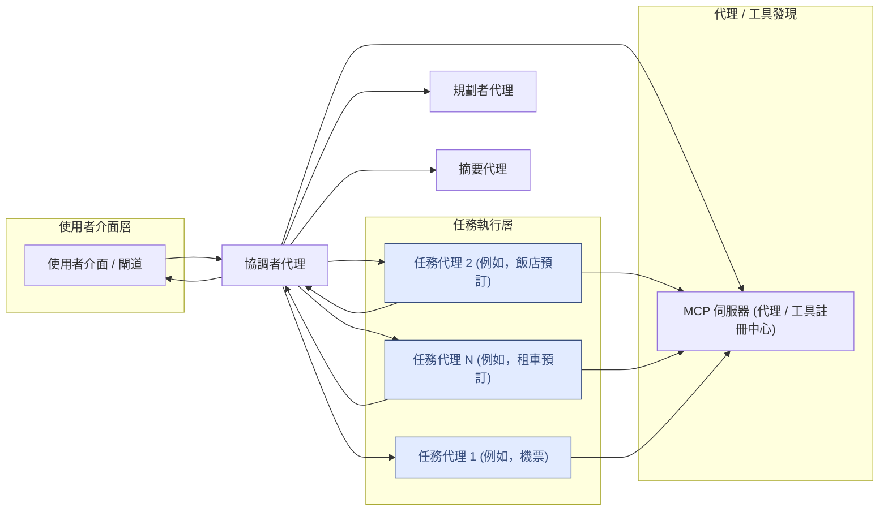

# 將 MCP 作為註冊中心的 A2A

**利用模型內容協議 (MCP) 作為發現和檢索 Google A2A 代理卡的標準化機制，使用 A2A 實現動態代理互動。**

## 目錄

- [將 MCP 作為註冊中心的 A2A](#將-mcp-作為註冊中心的-a2a)
  - [目錄](#目錄)
  - [目標](#目標)
  - [背景](#背景)
    - [A2A 協議](#a2a-協議)
    - [模型內容協議 (MCP)](#模型內容協議-mcp)
  - [核心提案](#核心提案)
    - [儲存代理卡](#儲存代理卡)
    - [透過 MCP 發現代理](#透過-mcp-發現代理)
    - [檢索代理卡](#檢索代理卡)
    - [為任務尋找代理](#為任務尋找代理)
    - [啟動 A2A 通訊](#啟動-a2a-通訊)
  - [使用案例：協調任務執行](#使用案例協調任務執行)
    - [核心概念](#核心概念)
    - [架構組件](#架構組件)
  - [範例流程：旅行代理](#範例流程旅行代理)
  - [執行範例的步驟](#執行範例的步驟)
    - [檔案/目錄說明](#檔案目錄說明)
  - [免責聲明](#免責聲明)

## 目標

利用模型內容協議 (MCP) 作為發現和檢索 Google A2A 代理卡的標準化機制。這使得動態的代理互動成為可能，特別是對於使用 A2A 協議的規劃和協調代理。

## 背景

### A2A 協議

代理對代理 (A2A) 協議標準化了代理之間的執行期通訊。它定義了：

- **代理卡 (Agent Card)**：一個描述代理身份、能力（操作/功能）和互動端點的 JSON 結構。
- **訊息格式與互動流程**：例如用於直接代理對代理互動的 `ExecuteTask`。

### 模型內容協議 (MCP)

MCP 為應用程式（包括 AI 模型）定義了一種標準方式，以發現、存取和利用上下文資訊，這些資訊被稱為「工具」、「資源」等。

## 核心提案

中心思想是將 MCP 伺服器用作 A2A 代理卡的集中式、可查詢的儲存庫。

### 儲存代理卡

- 每個 A2A 代理卡 (JSON) 都被儲存（例如，作為 JSON 檔案）。
- MCP 伺服器將這些代理卡作為資源公開。
- 底層儲存系統可以是檔案系統、資料庫，甚至是向量儲存。此範例使用儲存在檔案系統中的代理卡，生成嵌入並使用它們來尋找匹配項。

### 透過 MCP 發現代理

- 客戶端查詢 MCP 伺服器的資源 API (`list_resources`) 以發現可用的代理卡。
- 可以使用額外的元數據進行過濾（例如，`streaming` 支援、像 `currency conversion` 這樣的標籤），儘管本範例中未明確涵蓋。

### 檢索代理卡

- 請求代理使用從發現中獲取的資源 URI，透過 MCP 伺服器 API 獲取完整的 JSON 代理卡。

### 為任務尋找代理

- 請求代理可以使用 MCP 伺服器上公開的工具，為特定查詢找到最相關的代理。

### 啟動 A2A 通訊

- 一旦檢索到代理卡，請求代理就在 A2AClient 中使用它們。
- 需要協作者的代理（如規劃代理）然後使用標準的 A2A 協議直接與目標代理通訊。
- 在發現之後，MCP 不參與此直接的執行期互動。

## 使用案例：協調任務執行

該系統使得專業代理能夠動態協作的工作流程成為可能。

### 核心概念

1.  **協調 (Orchestration)**：規劃者和執行者代理管理使用者查詢的整體流程。
2.  **專業化 (Specialization)**：任務代理是特定類型任務的專家。
3.  **動態發現 (Dynamic Discovery)**：MCP 伺服器允許靈活地新增、移除或更新任務代理，而無需修改執行者。
4.  **標準化通訊 (Standardized Communication)**：A2A 協議確保了可靠的代理間通訊。

### 架構組件

1.  **使用者介面 (UI) / 應用程式閘道**：使用者查詢的進入點。
2.  **協調者代理 (Orchestrator Agent)**：
    -   從規劃者代理接收結構化的計畫。
    -   迭代執行任務。
    -   對於每個任務：
        -   根據任務（以及額外能力）查詢 MCP 伺服器以找到合適的任務代理。
        -   透過 A2A 連接並將任務詳細資訊發送給任務代理。
        -   透過 A2A 從任務代理接收結果。
        -   管理任務狀態和錯誤。
    -   驗證結果，並視需要觸發重新規劃。
    -   綜合、總結並將結果格式化為連貫的使用者回應。
3.  **規劃者代理 (Planner Agent)**：
    -   接收原始使用者查詢。
    -   將查詢分解為結構化的任務計畫（可能是 DAG），為每個任務指定所需的能力。
4.  **模型內容協議 (MCP) 伺服器**：
    -   作為任務代理的註冊中心，託管它們的代理卡。
    -   為執行者代理提供查詢代理的介面。
    -   為執行者代理提供查詢工具的介面。
5.  **任務代理 (Task Agents) (池/隊列)**：
    -   獨立、專業的代理（例如，搜尋代理、計算代理）。
    -   公開與 A2A 相容的端點。
    -   執行任務並透過 A2A 將結果返回給執行者。
6.  **A2A 通訊層**：代理間通訊的底層協議。



## 範例流程：旅行代理

1.  使用者請求一個旅行計畫。
2.  **協調者代理** 接收到請求。
    1.  透過 MCP 查找 **規劃者代理** 的卡片並連接。
    2.  呼叫規劃者代理以獲取詳細計畫。
    3.  對於計畫中的每一步：
        1.  呼叫一個 MCP 工具（例如 `find_agent`）以獲取最佳任務代理的代理卡。
        2.  透過 A2A 呼叫選定的任務代理以執行任務：
            -   _機票：_ 任務代理將使用 MCP 伺服器上的一個輔助工具。該工具查詢 SQLLite 資料庫以尋找航班。
            -   _飯店：_ 任務代理將使用 MCP 伺服器上的一個輔助工具。
                該工具查詢 SQLLite 資料庫以尋找飯店。
            -   _租車：_ 任務代理將使用 MCP 伺服器上的一個輔助工具。
                該工具查詢 SQLLite 資料庫以尋找租賃汽車。
        3.  將結果儲存在記憶體中。
    4.  匯總結果並為客戶端總結。
    5.  如果代理發現預算不符或預訂失敗，則啟動重新規劃任務。

## 執行範例的步驟

此範例使用 3 個 ADK 代理來執行任務，以及一個作為規劃者的 LangGraph 代理。
所有 3 個 ADK 代理都使用相同的 python 程式碼，但使用不同的代理卡進行實例化。

您可以執行以下命令在一個終端中運行所有步驟：

```sh
bash samples/python/agents/a2a_mcp/run.sh
```

1.  啟動 MCP 伺服器：

    ```sh
    cd samples/python/agents/a2a_mcp
    uv venv # (如果尚未完成)
    source .venv/bin/activate
    # 預設在埠 10100 上運行，可根據需要通過設置 --host 和 --port 參數進行更改。
    uv run  --env-file .env a2a-mcp --run mcp-server --transport sse
    ```

2.  啟動協調者代理：

    在新終端視窗中

    ```bash
    cd samples/python/agents/a2a_mcp
    uv venv # (如果尚未完成)
    source .venv/bin/activate
    # 注意：根據需要更改主機和埠。
    uv run --env-file .env src/a2a_mcp/agents/ --agent-card agent_cards/orchestrator_agent.json --port 10101
    ```

3.  啟動規劃者代理：

    在新終端視窗中

    ```bash
    cd samples/python/agents/a2a_mcp
    uv venv # (如果尚未完成)
    source .venv/bin/activate
    # 注意：根據需要更改主機和埠。
    uv run  --env-file .env src/a2a_mcp/agents/ --agent-card agent_cards/planner_agent.json --port 10102
    ```

4.  啟動航空公司票務代理：

    在新終端視窗中

    ```bash
    cd samples/python/agents/a2a_mcp
    uv venv # (如果尚未完成)
    source .venv/bin/activate
    # 注意：根據需要更改主機和埠。
    uv run --env-file .env src/a2a_mcp/agents/ --agent-card agent_cards/air_ticketing_agent.json --port 10103
    ```

5.  啟動飯店預訂代理：

    在新終端視窗中

    ```bash
    cd samples/python/agents/a2a_mcp
    uv venv # (如果尚未完成)
    source .venv/bin/activate
    # 注意：根據需要更改主機和埠。
    uv run  --env-file .env src/a2a_mcp/agents/ --agent-card agent_cards/hotel_booking_agent.json --port 10104
    ```

6.  啟動租車預訂代理：

    在新終端視窗中

    ```bash
    cd samples/python/agents/a2a_mcp
    uv venv  # (如果尚未完成)
    source .venv/bin/activate
    # 注意：根據需要更改主機和埠。
    uv run --env-file .env src/a2a_mcp/agents/ --agent-card agent_cards/car_rental_agent.json --port 10105
    ```

7.  啟動 cli：

    在新終端視窗中

    ```bash
    cd samples/python/agents/a2a_mcp
    uv venv  # (如果尚未完成)
    source .venv/bin/activate

    uv run --env-file .env src/a2a_mcp/mcp/client.py --resource "resource://agent_cards/list" --find_agent "我想計畫一趟去法國的旅行。"
    ```


### 檔案/目錄說明

- **`agent_cards/`**：此目錄儲存每個 A2A 代理卡的 JSON 結構。這些卡片定義了系統中不同代理的身份、能力和端點。MCP 伺服器提供這些卡片。

  - `*_agent.json`：每個 JSON 檔案代表一個特定代理的卡片（例如，`air_ticketing_agent.json` 用於處理航班預訂的代理）。

- **`src/a2a_mcp/`**：此 A2A with MCP 範例的主要 Python 原始碼。

  - **`agents/`**：包含設計文件中描述的不同類型代理的 Python 實作。
    - `__main__.py`：啟動代理服務的主腳本。
    - `adk_travel_agent.py`：這是使用 ADK 建立的核心旅行代理，使用不同的代理卡來實例化代理。
    - `langgraph_planner_agent.py`：使用 LangGraph 的「規劃者代理」的實作，負責將使用者請求分解為結構化計畫。
    - `orchestrator_agent.py`：實作「協調者代理」，它從規劃者那裡獲取計畫，透過 MCP 發現適當的任務代理，並使用 A2A 呼叫它們。
  - **`common/`**：包含由多個代理或系統部分使用的共享程式碼。
    - `agent_executor.py`：一個 A2A 模組，用於管理協調流程中的狀態、相依性和任務執行。
    - `agent_runner.py`：一個用於運行 ADK 代理實例、管理其生命週期並公開其服務的實用程式或框架組件。
    - `base_agent.py`：一個抽象基礎類別或介面，定義此專案中所有代理的通用方法和屬性。
    - `prompts.py`：包含用於在代理內部與大型語言模型 (LLM) 互動的預定義提示模板（例如，用於規劃或摘要）。
    - `types.py`：定義整個專案中使用的自訂 Python 資料類型、Pydantic 模型或列舉（例如，用於表示任務、代理卡結構或 API 請求/回應）。
    - `utils.py`：通用實用程式函式的集合。
    - `workflow.py`：管理流程的工作流程。
  - **`mcp/`**：包含與模型內容協議相關的實作。
    - `client.py`：一個輔助的 MCP 客戶端函式庫，用於向 MCP 伺服器查詢代理卡或工具。這是一個測試實用程式，代理不使用。
    - `server.py`：MCP 伺服器本身的實作。此伺服器將代理卡作為資源託管。

- **`travel_agency.db`**：一個輕量級的 SQLLite 資料庫，託管演示資料。

## 免責聲明
重要提示：所提供的範例程式碼僅供示範之用，並說明了代理對代理 (A2A) 協議的機制。在建構生產應用程式時，將任何在您直接控制之外運行的代理視為潛在不受信任的實體至關重要。

從外部代理接收的所有資料——包括但不限於其代理卡、訊息、產出和任務狀態——都應作為不受信任的輸入處理。例如，惡意代理可能提供在其欄位（例如，描述、名稱、技能描述）中包含精心製作的資料的代理卡。如果在使用此資料時未經清理就用於建構大型語言模型 (LLM) 的提示，可能會使您的應用程式面臨提示注入攻擊的風險。未能在使用前正確驗證和清理此資料，可能會給您的應用程式帶來安全漏洞。

開發人員有責任實施適當的安全措施，例如輸入驗證和安全處理憑證，以保護他們的系統和使用者。
