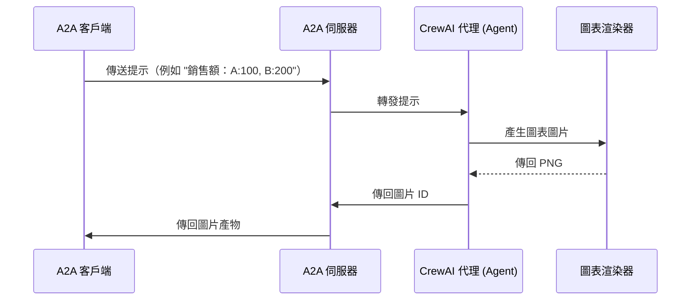

# 具有 A2A 協定的分析代理 (Analytics Agent)

此範例示範了一個輕量級的分析代理 (Agent)，它使用 [CrewAI](https://www.crewai.com/open-source)、`pandas` 和 `matplotlib` 從使用者提示中產生**圖表**（目前為長條圖；將會增強以處理更多圖表類型），並透過 [A2A 協定](https://google.github.io/A2A/#/documentation) 提供服務。

## YouTube [教學](https://www.youtube.com/watch?v=FYEXKh9LxUU&t=9s)

雖然最初專注於圖表繪製，但此代理 (Agent) 為更進階的分析工作流程奠定了基礎。

---

## 功能

此代理 (Agent) 將簡單的使用者提示（例如 `"產生營收圖表：一月,$1000 二月,$2000 三月,$1500"`）轉換為視覺化圖表。它使用：

- **自然語言 + 結構化數值** → 解析為 CSV
- **圖表推斷** → 準備長條圖資料
- **Matplotlib 渲染** → 輸出 PNG 圖片
- **CrewAI + A2A** → 與外部客戶端的標準化互動

範例結果：

> 🧾 提示：`產生營收圖表：一月,$1000 二月,$2000 三月,$1500`
> 📊 輸出：圖表的 PNG 圖片

---

## 運作方式

此架構使用 CrewAI 和可選的 Gemini API（或 OpenAI）來解譯提示並產生視覺輸出。A2A 協定有助於客戶端和代理 (Agent) 之間的通訊。



---

## 主要元件

- **CrewAI 代理 (Agent)**：具有專門工具的圖片產生代理 (Agent)
- **A2A 伺服器**：提供與代理 (Agent) 互動的標準化協定
- **圖片產生**：使用 Gemini API 從文字描述建立圖片
- **快取系統**：儲存產生的圖片以供擷取（記憶體內或基於檔案）

---

## 先決條件

- Python 3.12 或更高版本
- [UV](https://docs.astral.sh/uv/) 套件管理器（建議）
- Google API 金鑰（用於 Gemini 存取）

---

## 設定與執行

1. 導覽至範例目錄：

   ```bash
   cd samples/python/agents/analytics
   ```

2. 建立包含您的 API 金鑰（或 Vertex AI 憑證）的環境檔案：

   ```bash
   echo "OPENAI_API_KEY=your_openai_key_here" > .env
   ```

3. 設定 Python 環境：

   ```bash
   uv python pin 3.12
   uv venv
   source .venv/bin/activate
   ```

4. 使用所需選項執行代理 (Agent)：

   ```bash
   # 基本執行
   uv run .

   # 在自訂主機/通訊埠上執行
   uv run . --host 0.0.0.0 --port 8080
   ```

5. 執行 A2A 客戶端：

   在另一個終端機中：

   ```bash
   cd samples/python/hosts/cli
   uv run . --agent http://localhost:10011
   ```

   如果您在啟動代理 (Agent) 時變更了其通訊埠，請相應地更新 URL：

   ```bash
   uv run . --agent http://localhost:YOUR_PORT
   ```

   或執行[示範應用程式](/A2A/A2A/demo/README.md)

---

## 功能與改進

**功能：**

- 使用 Google Gemini 和 Matplotlib 進行文字到圖表圖片的產生
- 支援 OpenAI 和 Gemini LLM
- 具有自動重試功能的強大錯誤處理
- 可選的基於檔案的快取持久性
- 改進了從查詢中擷取產物 ID 的功能
- 直接向客戶端傳回 PNG 圖片
- A2A 協定相容性

**限制：**

- 沒有真正的串流（CrewAI 本身不支援）
- 有限的代理 (Agent) 互動（沒有多輪對話）

---

## 了解更多

- [A2A 協定文件](https://google.github.io/A2A/#/documentation)
- [CrewAI 文件](https://docs.crewai.com/introduction)
- [Google Gemini API](https://ai.google.dev/gemini-api)
- [Matplotlib 文件](https://matplotlib.org/stable/index.html)

---

## 作者

Gabe Jakobson, 2025

## 免責聲明

重要提示：此處提供的範例程式碼僅供示範之用，旨在說明代理對代理 (A2A) 協定的運作機制。在建構實際應用程式時，至關重要的是將任何在您直接控制範圍之外運作的代理 (Agent) 視為潛在不受信任的實體。

所有從外部代理 (Agent) 接收的資料——包括但不限於其 AgentCard、訊息、產物和任務狀態——都應作為不受信任的輸入來處理。舉例來說，一個惡意代理 (Agent) 可能在其 AgentCard 的欄位（例如：description、name、skills.description）中提供經過精心設計的資料。如果這些資料在未經清理的情況下被用來建構大型語言模型 (LLM) 的提示，可能會使您的應用程式遭受提示注入攻擊 (prompt injection attacks)。若未能在使用前對這些資料進行適當的驗證和清理，可能會為您的應用程式帶來安全漏洞。

開發人員有責任實施適當的安全措施，例如輸入驗證和安全處理憑證，以保護他們的系統和使用者。
