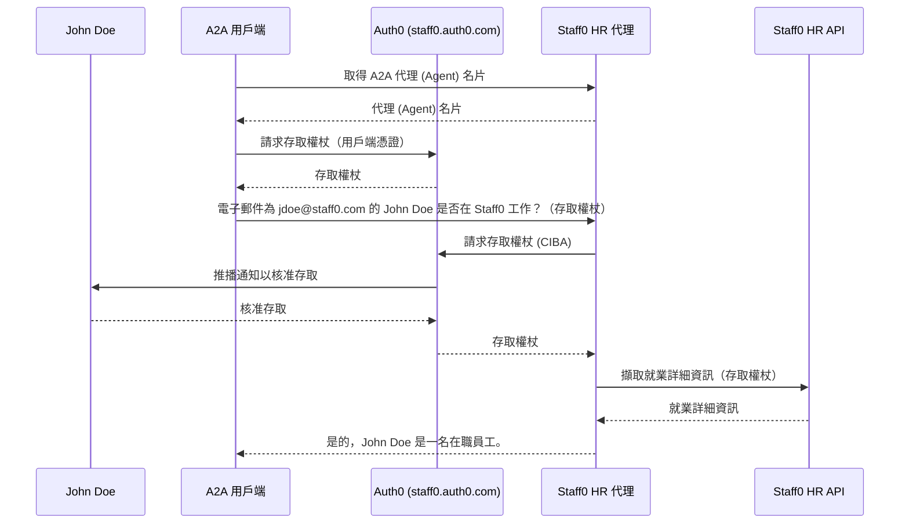

# 無頭代理 (Headless Agents) 的驗證

此範例示範了無頭代理 (Headless Agent) 的工具如何利用 [Auth0 的用戶端發起的後通道驗證 (CIBA) 流程](https://auth0.com/docs/get-started/authentication-and-authorization-flow/client-initiated-backchannel-authentication-flow) 透過推播通知請求使用者授權，並取得用於存取不同 API 的權杖。

此外，它還展示了透過 [OAuth 2.0 用戶端憑證流程](https://auth0.com/docs/get-started/authentication-and-authorization-flow/client-credentials-flow) 進行的代理層級授權。

## 運作方式

允許 A2A 用戶端安全地與虛構公司 Staff0 擁有的外部 HR 代理 (Agent) 互動，以驗證所提供的使用者資料是否對應於在職員工。

在相關員工的授權下（透過推播通知），Staff0 HR 代理 (Agent) 可以存取公司內部的 HR API 以擷取就業詳細資訊。



## 先決條件

- Python 3.12 或更高版本
- [UV](https://docs.astral.sh/uv/)
- [Gemini API 金鑰](https://ai.google.dev/gemini-api/docs/api-key)
- 一個 [Auth0](https://auth0.com/) 租戶，具有以下設定：
  - **API**
    - HR API
      - 對象：`https://staff0/api`
      - 權限：`read:employee`
    - HR 代理 (Agent)
      - 對象：`https://staff0/agent`
      - 權限：`read:employee_status`
  - **應用程式**
    - A2A 用戶端
      - 授權類型：`用戶端憑證`
      - API：`HR 代理 (Agent)`（已啟用權限：`read:employee_status`）
    - HR 代理 (Agent)
      - 授權類型：`用戶端發起的後通道驗證 (CIBA)`
      - API：`Auth0 管理 API`（已啟用權限：`read:users`）
  - 必須 `啟用` 使用 [Auth0 Guardian](https://auth0.com/docs/secure/multi-factor-authentication/auth0-guardian) 的推播通知。
  - 一個已註冊 Guardian MFA 的測試使用者。

## 執行範例

1. 透過複製 [.env.example](.env.example) 建立一個 `.env` 檔案，並提供必要的環境變數值。

2. 啟動 HR 代理 (Agent) 和 HR API：

   ```bash
   uv run --prerelease=allow .
   ```

3. 執行測試用戶端：
   ```bash
   uv run --prerelease=allow test_client.py
   ```

## 免責聲明
重要提示：所提供的範例程式碼僅供示範之用，旨在說明代理對代理 (Agent-to-Agent, A2A) 協定的運作機制。在建構生產應用程式時，至關重要的是將任何在您直接控制範圍之外運作的代理 (Agent) 視為潛在不受信任的實體。

從外部代理 (Agent) 收到的所有資料——包括但不限於其代理名片 (AgentCard)、訊息、產物 (Artifact) 和任務狀態——都應視為不受信任的輸入。例如，惡意代理 (Agent) 可能會提供一個在其欄位（例如，描述、名稱、技能描述）中包含精心設計的資料的代理名片 (AgentCard)。如果此資料未經淨化就用於為大型語言模型 (LLM) 建構提示，則可能使您的應用程式面臨提示注入攻擊的風險。未能在使用前正確驗證和淨化此資料可能會在您的應用程式中引入安全漏洞。

開發人員有責任實施適當的安全措施，例如輸入驗證和安全處理憑證，以保護其系統和使用者。