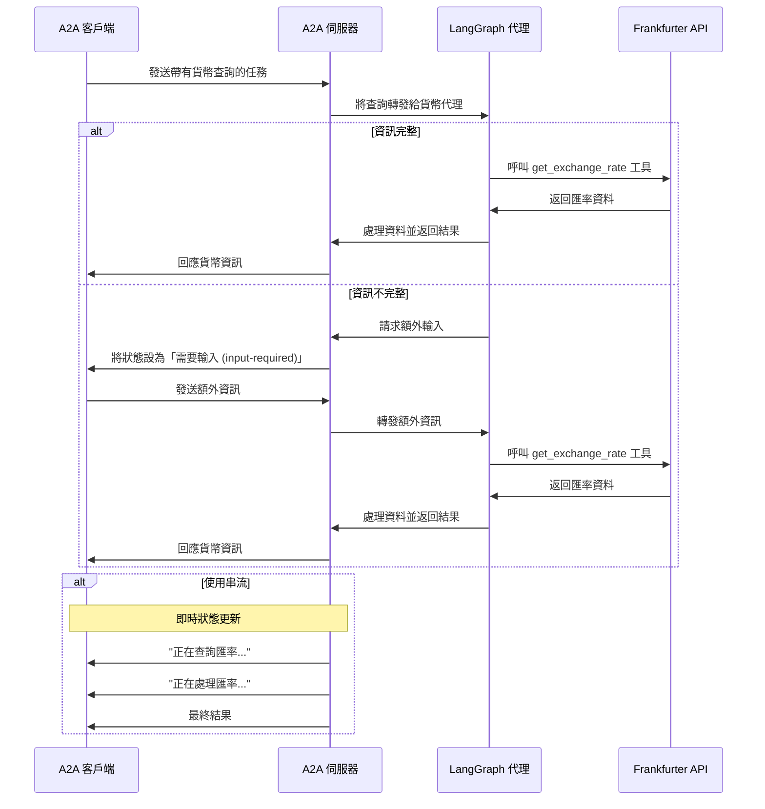

# 使用 A2A 協定的 LangGraph 貨幣代理

此範例展示了一個使用 [LangGraph](https://langchain-ai.github.io/langgraph/) 建置並透過 A2A 協定公開的貨幣轉換代理。它展示了支援多輪對話和串流回應的對話式互動。

## 運作方式

此代理使用 LangGraph 搭配大型語言模型（LLM，例如 Google Gemini）透過 ReAct 代理模式提供貨幣兌換資訊。A2A 協定可實現與代理的標準化互動，允許客戶端發送請求並接收即時更新。



## 主要功能

- **多輪對話 (Multi-turn Conversations)**：代理可在需要時請求額外資訊
- **即時串流 (Real-time Streaming)**：在處理過程中提供狀態更新
- **推播通知 (Push Notifications)**：支援基於 webhook 的通知
- **對話記憶 (Conversational Memory)**：在互動中維持上下文
- **貨幣兌換工具 (Currency Exchange Tool)**：與 Frankfurter API 整合以取得即時匯率

## 先決條件

- Python 3.12 或更高版本
- [UV](https://docs.astral.sh/uv/)
- 存取大型語言模型（LLM）和 API 金鑰

## 設定與執行

1. 導覽至範例目錄：

   ```bash
   cd samples/python/agents/langgraph
   ```

2. 建立一個包含您的 API 金鑰的環境檔案：

   ```bash
   如果您使用 Google Gemini 模型（gemini-pro 等）：
   echo "GOOGLE_API_KEY=your_api_key_here" > .env
  
   
   如果您使用 OpenAI 或任何相容的 API（例如，透過 Ollama、LM Studio 等的本地 LLM）：

   echo "API_KEY=your_api_key_here" > .env  （如果沒有 API 金鑰則非必要）
   echo "TOOL_LLM_URL=your_llm_url" > .env
   echo "TOOL_LLM_NAME=your_llm_name" > .env

   ```

3. 執行代理：

   ```bash
   # 在預設埠 10000 上基本執行
   uv run app

   # 在自訂主機/埠上執行
   uv run app --host 0.0.0.0 --port 8080
   ```

4. 在另一個終端機中，執行測試客戶端：

   ```bash
   uv run app/test_client.py
   ```

## 建置容器映像

代理也可以使用容器檔案來建置。

1. 導覽至 `samples/python/agents/langgraph` 目錄：

  ```bash
  cd samples/python/agents/langgraph
  ```

2. 建置容器檔案

    ```bash
    podman build . -t langgraph-a2a-server
    ```

> [!Tip]  
> Podman 是 `docker` 的直接替代品，也可以在這些指令中使用。

3. 執行您的容器

    ```bash
    podman run -p 10000:10000 -e GOOGLE_API_KEY=your_api_key_here langgraph-a2a-server
    ```

4. 執行 A2A 客戶端（請遵循上一節的步驟 5）

> [!Important]
> * **存取 URL：** 您必須透過 URL `0.0.0.0:10000` 存取 A2A 客戶端。使用 `localhost` 將無法運作。
> * **主機名稱覆寫 (Hostname Override)：** 如果您要部署到容器外部主機名稱定義不同的環境中，請使用 `HOST_OVERRIDE` 環境變數在代理卡 (Agent Card) 上設定預期的主機名稱。這可確保與您的客戶端應用程式正常通訊。

## 技術實作

- **LangGraph ReAct 代理**：使用 ReAct 模式進行推理和工具使用
- **串流支援 (Streaming Support)**：在處理過程中提供增量更新
- **檢查點記憶 (Checkpoint Memory)**：在多輪對話之間維持對話狀態
- **推播通知系統 (Push Notification System)**：基於 Webhook 的更新，並使用 JWK 驗證
- **A2A 協定整合**：完全符合 A2A 規範

## 限制

- 僅支援基於文字的輸入/輸出（不支援多模態）
- 使用 Frankfurter API，其貨幣選項有限
- 記憶體是基於會話的，不會在伺服器重新啟動之間持續存在

## 範例

**同步請求**

請求：

```
POST http://localhost:10000
Content-Type: application/json

{
    "id": "12113c25-b752-473f-977e-c9ad33cf4f56",
    "jsonrpc": "2.0",
    "method": "message/send",
    "params": {
        "message": {
            "kind": "message",
            "messageId": "120ec73f93024993becf954d03a672bc",
            "parts": [
                {
                    "kind": "text",
                    "text": "how much is 10 USD in INR?"
                }
            ],
            "role": "user"
        }
    }
}
```

回應：

```
{
    "id": "12113c25-b752-473f-977e-c9ad33cf4f56",
    "jsonrpc": "2.0",
    "result": {
        "artifacts": [
            {
                "artifactId": "08373241-a745-4abe-a78b-9ca60882bcc6",
                "name": "conversion_result",
                "parts": [
                    {
                        "kind": "text",
                        "text": "10 USD is 856.2 INR."
                    }
                ]
            }
        ],
        "contextId": "e329f200-eaf4-4ae9-a8ef-a33cf9485367",
        "history": [
            {
                "contextId": "e329f200-eaf4-4ae9-a8ef-a33cf9485367",
                "kind": "message",
                "messageId": "120ec73f93024993becf954d03a672bc",
                "parts": [
                    {
                        "kind": "text",
                        "text": "how much is 10 USD in INR?"
                    }
                ],
                "role": "user",
                "taskId": "58124b63-dd3b-46b8-bf1d-1cc1aefd1c8f"
            },
            {
                "contextId": "e329f200-eaf4-4ae9-a8ef-a33cf9485367",
                "kind": "message",
                "messageId": "d8b4d7de-709f-40f7-ae0c-fd6ee398a2bf",
                "parts": [
                    {
                        "kind": "text",
                        "text": "Looking up the exchange rates..."
                    }
                ],
                "role": "agent",
                "taskId": "58124b63-dd3b-46b8-bf1d-1cc1aefd1c8f"
            },
            {
                "contextId": "e329f200-eaf4-4ae9-a8ef-a33cf9485367",
                "kind": "message",
                "messageId": "ee0cb3b6-c3d6-4316-8d58-315c437a2a77",
                "parts": [
                    {
                        "kind": "text",
                        "text": "Processing the exchange rates.."
                    }
                ],
                "role": "agent",
                "taskId": "58124b63-dd3b-46b8-bf1d-1cc1aefd1c8f"
            }
        ],
        "id": "58124b63-dd3b-46b8-bf1d-1cc1aefd1c8f",
        "kind": "task",
        "status": {
            "state": "completed"
        }
    }
}
```

**多輪對話範例**

請求 - 序列 1：

```
POST http://localhost:10000
Content-Type: application/json

{
    "id": "27be771b-708f-43b8-8366-968966d07ec0",
    "jsonrpc": "2.0",
    "method": "message/send",
    "params": {
        "message": {
            "kind": "message",
            "messageId": "296eafc9233142bd98279e4055165f12",
            "parts": [
                {
                    "kind": "text",
                    "text": "How much is the exchange rate for 1 USD?"
                }
            ],
            "role": "user"
        }
    }
}
```

回應 - 序列 2：

```
{
    "id": "27be771b-708f-43b8-8366-968966d07ec0",
    "jsonrpc": "2.0",
    "result": {
        "contextId": "a7cc0bef-17b5-41fc-9379-40b99f46a101",
        "history": [
            {
                "contextId": "a7cc0bef-17b5-41fc-9379-40b99f46a101",
                "kind": "message",
                "messageId": "296eafc9233142bd98279e4055165f12",
                "parts": [
                    {
                        "kind": "text",
                        "text": "How much is the exchange rate for 1 USD?"
                    }
                ],
                "role": "user",
                "taskId": "9d94c2d4-06e4-40e1-876b-22f5a2666e61"
            }
        ],
        "id": "9d94c2d4-06e4-40e1-876b-22f5a2666e61",
        "kind": "task",
        "status": {
            "message": {
                "contextId": "a7cc0bef-17b5-41fc-9379-40b99f46a101",
                "kind": "message",
                "messageId": "f0f5f3ff-335c-4e77-9b4a-01ff3908e7be",
                "parts": [
                    {
                        "kind": "text",
                        "text": "Please specify which currency you would like to convert to."
                    }
                ],
                "role": "agent",
                "taskId": "9d94c2d4-06e4-40e1-876b-22f5a2666e61"
            },
            "state": "input-required"
        }
    }
}
```

請求 - 序列 3：

```
POST http://localhost:10000
Content-Type: application/json

{
    "id": "b88d818d-1192-42be-b4eb-3ee6b96a7e35",
    "jsonrpc": "2.0",
    "method": "message/send",
    "params": {
        "message": {
            "contextId": "a7cc0bef-17b5-41fc-9379-40b99f46a101",
            "kind": "message",
            "messageId": "70371e1f231f4597b65ccdf534930ca9",
            "parts": [
                {
                    "kind": "text",
                    "text": "CAD"
                }
            ],
            "role": "user",
            "taskId": "9d94c2d4-06e4-40e1-876b-22f5a2666e61"
        }
    }
}
```

回應 - 序列 4：

```
{
    "id": "b88d818d-1192-42be-b4eb-3ee6b96a7e35",
    "jsonrpc": "2.0",
    "result": {
        "artifacts": [
            {
                "artifactId": "08373241-a745-4abe-a78b-9ca60882bcc6",
                "name": "conversion_result",
                "parts": [
                    {
                        "kind": "text",
                        "text": "The exchange rate for 1 USD to CAD is 1.3739."
                    }
                ]
            }
        ],
        "contextId": "a7cc0bef-17b5-41fc-9379-40b99f46a101",
        "history": [
            {
                "contextId": "a7cc0bef-17b5-41fc-9379-40b99f46a101",
                "kind": "message",
                "messageId": "296eafc9233142bd98279e4055165f12",
                "parts": [
                    {
                        "kind": "text",
                        "text": "How much is the exchange rate for 1 USD?"
                    }
                ],
                "role": "user",
                "taskId": "9d94c2d4-06e4-40e1-876b-22f5a2666e61"
            },
            {
                "contextId": "a7cc0bef-17b5-41fc-9379-40b99f46a101",
                "kind": "message",
                "messageId": "f0f5f3ff-335c-4e77-9b4a-01ff3908e7be",
                "parts": [
                    {
                        "kind": "text",
                        "text": "Please specify which currency you would like to convert to."
                    }
                ],
                "role": "agent",
                "taskId": "9d94c2d4-06e4-40e1-876b-22f5a2666e61"
            },
            {
                "contextId": "a7cc0bef-17b5-41fc-9379-40b99f46a101",
                "kind": "message",
                "messageId": "70371e1f231f4597b65ccdf534930ca9",
                "parts": [
                    {
                        "kind": "text",
                        "text": "CAD"
                    }
                ],
                "role": "user",
                "taskId": "9d94c2d4-06e4-40e1-876b-22f5a2666e61"
            },
            {
                "contextId": "a7cc0bef-17b5-41fc-9379-40b99f46a101",
                "kind": "message",
                "messageId": "0eb4f200-a8cd-4d34-94f8-4d223eb1b2c0",
                "parts": [
                    {
                        "kind": "text",
                        "text": "Looking up the exchange rates..."
                    }
                ],
                "role": "agent",
                "taskId": "9d94c2d4-06e4-40e1-876b-22f5a2666e61"
            },
            {
                "contextId": "a7cc0bef-17b5-41fc-9379-40b99f46a101",
                "kind": "message",
                "messageId": "41c7c03a-a772-4dc8-a868-e8c7b7defc91",
                "parts": [
                    {
                        "kind": "text",
                        "text": "Processing the exchange rates.."
                    }
                ],
                "role": "agent",
                "taskId": "9d94c2d4-06e4-40e1-876b-22f5a2666e61"
            }
        ],
        "id": "9d94c2d4-06e4-40e1-876b-22f5a2666e61",
        "kind": "task",
        "status": {
            "state": "completed"
        }
    }
}
```

**串流範例**

請求：

```
{
    "id": "6d12d159-ec67-46e6-8d43-18480ce7f6ca",
    "jsonrpc": "2.0",
    "method": "message/stream",
    "params": {
        "message": {
            "kind": "message",
            "messageId": "2f9538ef0984471aa0d5179ce3c67a28",
            "parts": [
                {
                    "kind": "text",
                    "text": "how much is 10 USD in INR?"
                }
            ],
            "role": "user"
        }
    }
}
```

回應：

```
data: {"id":"6d12d159-ec67-46e6-8d43-18480ce7f6ca","jsonrpc":"2.0","result":{"contextId":"cd09e369-340a-4563-bca4-e5f2e0b9ff81","history":[{"contextId":"cd09e369-340a-4563-bca4-e5f2e0b9ff81","kind":"message","messageId":"2f9538ef0984471aa0d5179ce3c67a28","parts":[{"kind":"text","text":"how much is 10 USD in INR?"}],"role":"user","taskId":"423a2569-f272-4d75-a4d1-cdc6682188e5"}],"id":"423a2569-f272-4d75-a4d1-cdc6682188e5","kind":"task","status":{"state":"submitted"}}}

data: {"id":"6d12d159-ec67-46e6-8d43-18480ce7f6ca","jsonrpc":"2.0","result":{"contextId":"cd09e369-340a-4563-bca4-e5f2e0b9ff81","final":false,"kind":"status-update","status":{"message":{"contextId":"cd09e369-340a-4563-bca4-e5f2e0b9ff81","kind":"message","messageId":"1854a825-c64f-4f30-96f2-c8aa558b83f9","parts":[{"kind":"text","text":"Looking up the exchange rates..."}],"role":"agent","taskId":"423a2569-f272-4d75-a4d1-cdc6682188e5"},"state":"working"},"taskId":"423a2569-f272-4d75-a4d1-cdc6682188e5"}}

data: {"id":"6d12d159-ec67-46e6-8d43-18480ce7f6ca","jsonrpc":"2.0","result":{"contextId":"cd09e369-340a-4563-bca4-e5f2e0b9ff81","final":false,"kind":"status-update","status":{"message":{"contextId":"cd09e369-340a-4563-bca4-e5f2e0b9ff81","kind":"message","messageId":"e72127a6-4830-4320-bf23-235ac79b9a13","parts":[{"kind":"text","text":"Processing the exchange rates.."}],"role":"agent","taskId":"423a2569-f272-4d75-a4d1-cdc6682188e5"},"state":"working"},"taskId":"423a2569-f272-4d75-a4d1-cdc6682188e5"}}

data: {"id":"6d12d159-ec67-46e6-8d43-18480ce7f6ca","jsonrpc":"2.0","result":{"artifact":{"artifactId":"08373241-a745-4abe-a78b-9ca60882bcc6","name":"conversion_result","parts":[{"kind":"text","text":"10 USD is 856.2 INR."}]},"contextId":"cd09e369-340a-4563-bca4-e5f2e0b9ff81","kind":"artifact-update","taskId":"423a2569-f272-4d75-a4d1-cdc6682188e5"}}

data: {"id":"6d12d159-ec67-46e6-8d43-18480ce7f6ca","jsonrpc":"2.0","result":{"contextId":"cd09e369-340a-4563-bca4-e5f2e0b9ff81","final":true,"kind":"status-update","status":{"state":"completed"},"taskId":"423a2569-f272-4d75-a4d1-cdc6682188e5"}}
```

## 了解更多

- [A2A 協定文件](https://a2a-protocol.org/)
- [LangGraph 文件](https://langchain-ai.github.io/langgraph/)
- [Frankfurter API](https://www.frankfurter.app/docs/)
- [Google Gemini API](https://ai.google.dev/gemini-api)


## 免責聲明
重要提示：所提供的範例程式碼僅供示範之用，並說明代理對代理 (A2A) 協定的機制。在建置生產應用程式時，將任何在您直接控制之外運作的代理視為潛在不受信任的實體至關重要。

從外部代理接收的所有資料——包括但不限於其代理卡 (AgentCard)、訊息、成品和任務狀態——都應作為不受信任的輸入處理。例如，惡意代理可能會提供一個在其欄位（例如，描述、名稱、技能描述）中包含精心設計資料的代理卡。如果在使用此類資料建構大型語言模型 (LLM) 的提示時未經清理，可能會使您的應用程式面臨提示注入攻擊的風險。未能在使用前正確驗證和清理此類資料可能會給您的應用程式帶來安全漏洞。

開發人員有責任實施適當的安全措施，例如輸入驗證和安全處理憑證，以保護其系統和使用者。
