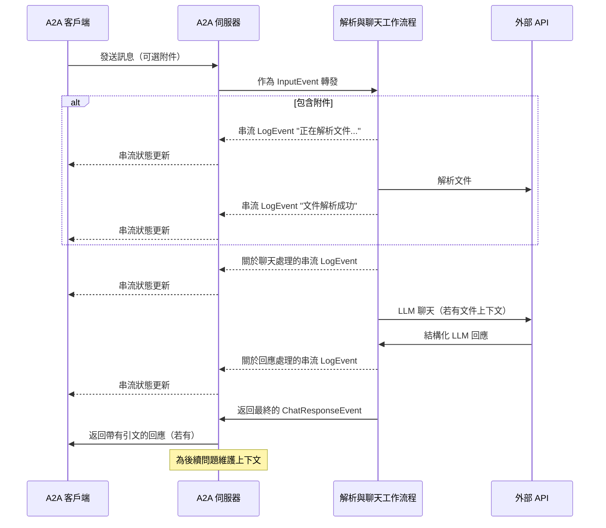

# LlamaIndex 檔案聊天工作流程與 A2A 協定

此範例展示了一個使用 [LlamaIndex Workflows](https://docs.llamaindex.ai/en/stable/understanding/workflows/) 建置並透過 A2A 協定公開的對話式代理。它展示了檔案上傳與解析、支援多輪對話的對話式互動、串流回應/更新以及內嵌引文。

## 運作方式

此代理使用 LlamaIndex Workflows 搭配 Google Gemini，提供一個可以上傳檔案、解析檔案並回答有關內容問題的對話式代理。A2A 協定可實現與代理的標準化互動，允許客戶端發送請求並接收即時更新。



## 主要功能

- **檔案上傳 (File Upload)**：客戶端可以上傳檔案並解析它們，以提供聊天上下文
- **多輪對話 (Multi-turn Conversations)**：代理可在需要時請求額外資訊
- **即時串流 (Real-time Streaming)**：在處理過程中提供狀態更新
- **推播通知 (Push Notifications)**：支援基於 webhook 的通知
- **對話記憶 (Conversational Memory)**：在同一個會話中維持互動的上下文
- **LlamaParse 整合 (LlamaParse Integration)**：使用 LlamaParse 準確解析檔案

**注意：** 此範例代理接受多模態輸入，但在撰寫本文時，範例 UI 僅支援文字輸入。未來 UI 將會支援多模態以處理此用例及其他用例。

## 先決條件

- Python 3.12 或更高版本
- [UV](https://docs.astral.sh/uv/)
- 存取大型語言模型（LLM）及 API 金鑰（目前程式碼假設使用 Google Gen AI API）
- LlamaParse API 金鑰（[免費取得](https://cloud.llamaindex.ai)）

## 設定與執行

1. 導覽至範例目錄：

   ```bash
   cd samples/python/agents/llama_index_file_chat
   ```

2. 建立一個包含您的 API 金鑰的環境檔案：

   ```bash
   echo "GOOGLE_API_KEY=your_api_key_here" >> .env
   echo "LLAMA_CLOUD_API_KEY=your_api_key_here" >> .env
   ```

3. 執行代理：

   ```bash
   # 在預設埠 10010 上基本執行
   uv run .

   # 在自訂主機/埠上執行
   uv run . --host 0.0.0.0 --port 8080
   ```

4. 在另一個終端機中，執行 A2A [客戶端](/samples/python/hosts/README.md)：

   ```bash
   cd samples/python/hosts/cli
   uv run . --agent http://localhost:10010
   ```

   下載一個檔案進行解析，或連結到您自己的檔案。例如：

   ```bash
   wget https://arxiv.org/pdf/1706.03762 -O attention.pdf
   ```

   然後輸入類似以下的內容：

   ```bash
   ======= Agent Card ========
   {"name":"Parse and Chat","description":"Parses a file and then chats with a user using the parsed content as context.","url":"http://localhost:10010/","version":"1.0.0","capabilities":{"streaming":true,"pushNotifications":true,"stateTransitionHistory":false},"defaultInputModes":["text","text/plain"],"defaultOutputModes":["text","text/plain"],"skills":[{"id":"parse_and_chat","name":"Parse and Chat","description":"Parses a file and then chats with a user using the parsed content as context.","tags":["parse","chat","file","llama_parse"],"examples":["What does this file talk about?"]}]}
   =========  starting a new task ======== 

   What do you want to send to the agent? (:q or quit to exit): What does this file talk about?
   Select a file path to attach? (press enter to skip): ./attention.pdf
   ```

## 技術實作

- **LlamaIndex 工作流程 (LlamaIndex Workflows)**：使用自訂工作流程來解析檔案，然後與使用者聊天
- **串流支援 (Streaming Support)**：在處理過程中提供增量更新
- **可序列化的上下文 (Serializable Context)**：在多輪對話之間維持對話狀態，可選擇性地持久化到 redis、mongodb、磁碟等。
- **推播通知系統 (Push Notification System)**：基於 Webhook 的更新，並使用 JWK 驗證
- **A2A 協定整合 (A2A Protocol Integration)**：完全符合 A2A 規範

## 限制

- 僅支援基於文字的輸出
- LlamaParse 在前 10K 積分（使用基本設定約 3333 頁）內免費
- 記憶體是基於會話且在記憶體中，因此在伺服器重新啟動之間不會持續存在
- 將整個文件插入上下文視窗對於較大的檔案不具可擴展性。您可能需要部署一個向量資料庫 (vector DB) 或使用雲端資料庫 (cloud DB) 來對一或多個檔案進行檢索，以實現有效的 RAG。LlamaIndex 與[大量的向量資料庫和雲端資料庫](https://docs.llamaindex.ai/en/stable/examples/#vector-stores)整合。

## 範例

**同步請求**

請求：

```
POST http://localhost:10010
Content-Type: application/json

{
  "jsonrpc": "2.0",
  "id": 11,
  "method": "message/send",
  "params": {
    "id": "129",
    "sessionId": "8f01f3d172cd4396a0e535ae8aec6687",
    "acceptedOutputModes": [
      "text"
    ],
    "message": {
      "role": "user",
      "parts": [
        {
          "type": "text",
          "text": "這個檔案在談論什麼？"
        },
        {
            "type": "file",
            "file": {
                "bytes": "...",
                "name": "attention.pdf"
            }
        }
      ]
    }
  }
}
```

回應：

```
{
  "jsonrpc": "2.0",
  "id": 11,
  "result": {
    "id": "129",
    "status": {
      "state": "completed",
      "timestamp": "2025-04-02T16:53:29.301828"
    },
    "artifacts": [
      {
        "parts": [
          {
            "type": "text",
            "text": "這個檔案是關於 XYZ... [1]"
          }
        ],
        "metadata": {
            "1": ["引文 1 的文字"]
        }
        "index": 0,
      }
    ],
  }
}
```

**多輪對話範例**

請求 - 序列 1：

```
POST http://localhost:10010
Content-Type: application/json

{
  "jsonrpc": "2.0",
  "id": 11,
  "method": "message/send",
  "params": {
    "id": "129",
    "sessionId": "8f01f3d172cd4396a0e535ae8aec6687",
    "acceptedOutputModes": [
      "text"
    ],
    "message": {
      "role": "user",
      "parts": [
        {
          "type": "text",
          "text": "這個檔案在談論什麼？"
        },
        {
            "type": "file",
            "file": {
                "bytes": "...",
                "name": "attention.pdf"
            }
        }
      ]
    }
  }
}
```

回應 - 序列 2：

```
{
  "jsonrpc": "2.0",
  "id": 11,
  "result": {
    "id": "129",
    "status": {
      "state": "completed",
      "timestamp": "2025-04-02T16:53:29.301828"
    },
    "artifacts": [
      {
        "parts": [
          {
            "type": "text",
            "text": "這個檔案是關於 XYZ... [1]"
          }
        ],
        "metadata": {
            "1": ["引文 1 的文字"]
        }
        "index": 0,
      }
    ],
  }
}
```

請求 - 序列 3：

```
POST http://localhost:10010
Content-Type: application/json

{
  "jsonrpc": "2.0",
  "id": 11,
  "method": "message/send",
  "params": {
    "id": "130",
    "sessionId": "8f01f3d172cd4396a0e535ae8aec6687",
    "acceptedOutputModes": [
      "text"
    ],
    "message": {
      "role": "user",
      "parts": [
        {
          "type": "text",
          "text": "關於 X 怎麼樣？"
        }
      ]
    }
  }
}
```

回應 - 序列 4：

```
{
  "jsonrpc": "2.0",
  "id": 11,
  "result": {
    "id": "130",
    "status": {
      "state": "completed",
      "timestamp": "2025-04-02T16:53:29.301828"
    },
    "artifacts": [
      {
        "parts": [
          {
            "type": "text",
            "text": "X 是 ... [1]"
          }
        ],
        "metadata": {
            "1": ["引文 1 的文字"]
        }
        "index": 0,
      }
    ],
  }
}
```

**串流範例**

請求：

```
{
  "jsonrpc": "2.0",
  "id": 11,
  "method": "message/send",
  "params": {
    "id": "129",
    "sessionId": "8f01f3d172cd4396a0e535ae8aec6687",
    "acceptedOutputModes": [
      "text"
    ],
    "message": {
      "role": "user",
      "parts": [
        {
          "type": "text",
          "text": "這個檔案在談論什麼？"
        },
        {
            "type": "file",
            "file": {
                "bytes": "...",
                "name": "attention.pdf"
            }
        }
      ]
    }
  }
}
```

回應：

```
stream event => {"jsonrpc":"2.0","id":"367d0ba9af97457890261ac29a0f6f5b","result":{"id":"373b26d64c5a4f0099fa906c6b7342d9","status":{"state":"working","message":{"role":"agent","parts":[{"type":"text","text":"正在解析文件..."}]},"timestamp":"2025-04-15T16:05:18.283682"},"final":false}}

stream event => {"jsonrpc":"2.0","id":"367d0ba9af97457890261ac29a0f6f5b","result":{"id":"373b26d64c5a4f0099fa906c6b7342d9","status":{"state":"working","message":{"role":"agent","parts":[{"type":"text","text":"文件解析成功。"}]},"timestamp":"2025-04-15T16:05:24.200133"},"final":false}}

stream event => {"jsonrpc":"2.0","id":"367d0ba9af97457890261ac29a0f6f5b","result":{"id":"373b26d64c5a4f0099fa906c6b7342d9","status":{"state":"working","message":{"role":"agent","parts":[{"type":"text","text":"正在與 1 則初始訊息聊天。"}]},"timestamp":"2025-04-15T16:05:24.204757"},"final":false}}

stream event => {"jsonrpc":"2.0","id":"367d0ba9af97457890261ac29a0f6f5b","result":{"id":"373b26d64c5a4f0099fa906c6b7342d9","status":{"state":"working","message":{"role":"agent","parts":[{"type":"text","text":"正在插入系統提示..."}]},"timestamp":"2025-04-15T16:05:24.204810"},"final":false}}

stream event => {"jsonrpc":"2.0","id":"367d0ba9af97457890261ac29a0f6f5b","result":{"id":"373b26d64c5a4f0099fa906c6b7342d9","status":{"state":"working","message":{"role":"agent","parts":[{"type":"text","text":"收到 LLM 回應，正在解析引文..."}]},"timestamp":"2025-04-15T16:05:26.084829"},"final":false}}

stream event => {"jsonrpc":"2.0","id":"367d0ba9af97457890261ac29a0f6f5b","result":{"id":"373b26d64c5a4f0099fa906c6b7342d9","artifact":{"parts":[{"type":"text","text":"此檔案討論了 Transformer，一種完全基於注意力機制的創新神經網路架構，完全摒棄了遞歸和卷積 [1]。該文件將 Transformer 與遞歸和卷積層進行了比較 [2]，詳細介紹了模型架構 [3]，並展示了機器翻譯和英語成分句法分析任務的結果 [4]。"}],"metadata":{"1":["主流的序列轉導模型基於複雜的遞歸或卷積神經網路，包括一個編碼器和一個解碼器。表現最好的模型還透過注意力機制連接編碼器和解碼器。我們提出了一種新的簡單網路架構，即 Transformer，它完全基於注意力機制，摒棄了遞歸和卷積。在兩項機器翻譯任務上的實驗表明，這些模型在品質上更優越，同時更易於並行化，並且需要顯著更少的訓練時間。我們的模型在 WMT 2014 英語到德語翻譯任務上達到了 28.4 BLEU，比現有的最佳結果（包括集成模型）提高了 2 個 BLEU 以上。在 WMT 2014 英語到法語翻譯任務上，我們的模型在八個 GPU 上訓練 3.5 天後，創下了 41.8 的新的單一模型最先進 BLEU 分數，這只是文獻中最佳模型訓練成本的一小部分。我們證明了 Transformer 可以很好地推廣到其他任務，並成功地將其應用於具有大量和有限訓練數據的英語成分句法分析。"],"2":["在本節中，我們將自注意力層的各個方面與通常用於將一個可變長度的符號表示序列 (x1, ..., xn) 映射到另一個等長序列 (z1, ..., zn) 的遞歸和卷積層進行比較，例如典型序列轉導編碼器或解碼器中的隱藏層。為了說明我們使用自注意力的動機，我們考慮了三個期望的特性。",""],"3":["# 3 模型架構"],"4":["# 6   結果"]},"index":0,"append":false}}}

stream event => {"jsonrpc":"2.0","id":"367d0ba9af97457890261ac29a0f6f5b","result":{"id":"373b26d64c5a4f0099fa906c6b7342d9","status":{"state":"completed","timestamp":"2025-04-15T16:05:26.111314"},"final":true}}
```

您可以看到工作流程產生了一個帶有內嵌引文的成品，而這些引文的來源文字包含在成品的元資料中。如果我們在同一個會話中發送更多回應，代理將會記住先前的訊息並繼續對話。

## 了解更多

- [A2A 協定文件](https://google.github.io/A2A/#/documentation)
- [LlamaIndex 工作流程文件](https://docs.llamaindex.ai/en/stable/understanding/workflows/)
- [LlamaIndex 工作流程範例](https://docs.llamaindex.ai/en/stable/examples/#agentic-workflows)
- [LlamaParse 文件](https://github.com/run-llama/llama_cloud_services/blob/main/parse.md)
- [Google Gemini API](https://ai.google.dev/gemini-api)


## 免責聲明
重要提示：所提供的範例程式碼僅供示範之用，並說明代理對代理 (A2A) 協定的機制。在建置生產應用程式時，將任何在您直接控制之外運作的代理視為潛在不受信任的實體至關重要。

從外部代理接收的所有資料——包括但不限於其代理卡 (AgentCard)、訊息、成品和任務狀態——都應作為不受信任的輸入處理。例如，惡意代理可能會提供一個在其欄位（例如，描述、名稱、技能描述）中包含精心設計資料的代理卡。如果在使用此類資料建構大型語言模型 (LLM) 的提示時未經清理，可能會使您的應用程式面臨提示注入攻擊的風險。未能在使用前正確驗證和清理此類資料可能會給您的應用程式帶來安全漏洞。

開發人員有責任實施適當的安全措施，例如輸入驗證和安全處理憑證，以保護其系統和使用者。