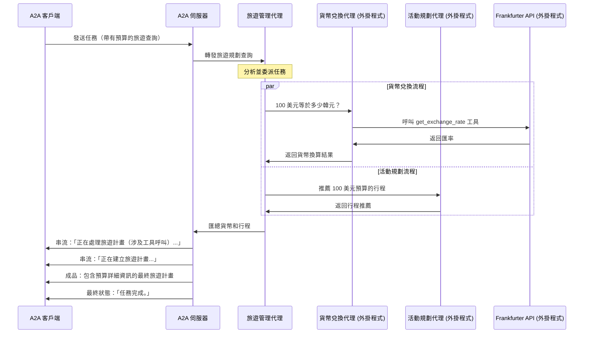

# 使用 A2A 協定的語意核心代理

此範例示範如何實作一個建置在 [語意核心 (Semantic Kernel)](https://github.com/microsoft/semantic-kernel/) 上並透過 A2A 協定公開的旅遊代理。它展示了：

- **多輪互動**：代理可能會要求澄清
- **串流回應**：返回增量狀態
- **對話記憶**：維持上下文（透過利用語意核心的 ChatHistory）
- **推播通知**：使用基於 webhook 的通知進行非同步更新
- **外部外掛程式（SK 代理和 Frankfurter API）**：說明如何將語意核心代理作為外掛程式使用，連同 API 一起，可用於產生旅遊計畫和擷取匯率



## 先決條件

- Python 3.10 或更高版本
- [uv](https://docs.astral.sh/uv/)
- 有效的 OpenAI/Azure OpenAI 或其他 LLM 憑證（取決於您的 SK 設定）。有關與 ChatCompletionAgent 一起使用的語意核心 AI 連接器的更多詳細資訊，請參閱[此處](https://learn.microsoft.com/en-us/semantic-kernel/concepts/ai-services/chat-completion/?tabs=csharp-AzureOpenAI%2Cpython-AzureOpenAI%2Cjava-AzureOpenAI&pivots=programming-language-python#creating-a-chat-completion-service)。
- 存取 Frankfurter API 金鑰（可選，或者您可以呼叫免費端點）

## 設定與執行

1. **導覽至範例目錄**：

```bash
cd samples/python/agents/semantickernel
```

2. **設定環境變數**：

根據 `.envexample` 檔案建立一個 `.env` 檔案。代理預設使用 Azure OpenAI。若要改用 OpenAI，您需要在 `agent.py` 中修改程式碼。

**對於 OpenAI：**

```bash
OPENAI_API_KEY="your_api_key_here"
OPENAI_CHAT_MODEL_ID="your-model-id"
```

**對於 Azure OpenAI（預設）：**

```bash
AZURE_OPENAI_API_KEY="your-azure-api-key-here"
AZURE_OPENAI_ENDPOINT="https://your-resource.openai.azure.com/"
AZURE_OPENAI_CHAT_DEPLOYMENT_NAME="your-deployment-name"
AZURE_OPENAI_API_VERSION="2024-12-01-preview"
```

若要從 Azure OpenAI 切換到 OpenAI，請在 `agent.py` 中變更此行：

```python
# 從此：
chat_service = get_chat_completion_service(ChatServices.AZURE_OPENAI)
# 到此：
chat_service = get_chat_completion_service(ChatServices.OPENAI)
```

> [!NOTE]
> 也可以使用其他 LLM，但您需要修改程式碼以透過聊天完成服務方法使用適當的 AI 連接器。有關如何設定其他 AI 服務的更多詳細資訊，請參閱語意核心[文件](https://learn.microsoft.com/en-us/semantic-kernel/concepts/ai-services/chat-completion/?tabs=csharp-AzureOpenAI%2Cpython-AzureOpenAI%2Cjava-AzureOpenAI&pivots=programming-language-python#creating-a-chat-completion-service)。

> [!NOTE]
> 有關環境變數的詳細資訊，請參閱[語意核心 AI 服務設定](https://github.com/microsoft/semantic-kernel/blob/main/python/samples/concepts/setup/ALL_SETTINGS.md#semantic-kernel-settings)文件。

3. **設定 Python 環境**：

> [!NOTE]
> 將 Python 版本釘選到您想要的版本 (3.10+)

```bash
uv python pin 3.12
uv venv
source .venv/bin/activate
```
4. **執行代理**：

選擇以下選項之一：

> [!NOTE]
> 確保您從以下目錄執行 `uv run .`：`samples/python/agents/semantickernel`

```bash
# 在預設埠 10020 上基本執行
uv run .
```
或

```bash
# 在自訂主機/埠上執行
uv run . --host 0.0.0.0 --port 8080
```

5. **在另一個終端機中，執行 A2A 客戶端**：

> [!NOTE]
> 確保您從以下目錄執行 `uv run . --agent http://localhost:10020`：`samples/python/hosts/cli`

```bash
cd samples/python/hosts/cli
uv run . --agent http://localhost:10020
```

## 建置容器映像

代理也可以使用容器檔案來建置。

1. 導覽至 `samples/python` 目錄：

  ```bash
  cd samples/python
  ```

2. 建置容器檔案

    ```bash
    podman build -f agents/semantickernel/Containerfile . -t semantickernel-a2a-server
    ```

> [!Tip]  
> Podman 是 `docker` 的直接替代品，也可以在這些指令中使用。

3. 執行您的容器

    ```bash
    podman run -p 10020:10020 -e OPENAI_API_KEY=your_api_key_here -e OPENAI_MODEL_ID=your-model-id semantickernel-a2a-server
    ```

> [!NOTE]
> 若要使用 Azure，請替換為上一節中的環境變數。

4. 執行 A2A 客戶端（請遵循上一節的步驟 5）

> [!Important]
> * **存取 URL：** 您必須透過 URL `0.0.0.0:10020` 存取 A2A 客戶端。使用 `localhost` 將無法運作。
> * **主機名稱覆寫：** 如果您要部署到容器外部主機名稱定義不同的環境中，請使用 `HOST_OVERRIDE` 環境變數在代理卡上設定預期的主機名稱。這可確保與您的客戶端應用程式正常通訊。

## 限制

- 目前僅支援基於文字的輸入/輸出
- Frankfurter API 的貨幣換算集有限
- 基於會話的記憶體是暫時的（在記憶體中）

## 範例端點

您可以使用 JSON-RPC 指定 message/send 或 message/stream，將 A2A 請求 POST 到 http://localhost:10020。這是一個同步程式碼片段：

### 請求：

POST http://localhost:10020
Content-Type: application/json

```json
{
  "jsonrpc": "2.0",
  "id": 33,
  "method": "message/send",
  "params": {
    "id": "3",
    "sessionId": "1aab49f1e85c499da48c2124f4ceee4d",
    "acceptedOutputModes": ["text"],
    "message": {
      "role": "user",
      "parts": [
        { "type": "text", "text": "1 美元等於多少歐元？" }
      ]
    }
  }
}
```

### 回應：

```json
{
  "jsonrpc": "2.0",
  "id": 33,
  "result": {
    "id": "3",
    "status": {
      "state": "completed",
      "timestamp": "2025-04-01T16:53:29.301828"
    },
    "artifacts": [
      {
        "parts": [
          {
            "type": "text",
            "text": "1 美元約等於 0.88137 歐元。"
          }
        ],
        "index": 0
      }
    ],
    "history": []
  }
}
```

對於多輪、串流等也是如此。

有關更多詳細資訊，請參閱 [A2A 協定文件](https://google.github.io/A2A/#/documentation)和[語意核心文件](https://learn.microsoft.com/en-us/semantic-kernel/get-started/quick-start-guide?pivots=programming-language-python)。


## 免責聲明
重要提示：所提供的範例程式碼僅供示範之用，並說明代理對代理 (A2A) 協定的機制。在建置生產應用程式時，將任何在您直接控制之外運作的代理視為潛在不受信任的實體至關重要。

從外部代理接收的所有資料——包括但不限於其代理卡 (AgentCard)、訊息、成品和任務狀態——都應作為不受信任的輸入處理。例如，惡意代理可能會提供一個在其欄位（例如，描述、名稱、技能描述）中包含精心設計資料的代理卡。如果在使用此類資料時未經清理就用於建構大型語言模型 (LLM) 的提示，可能會使您的應用程式面臨提示注入攻擊的風險。未能在使用前正確驗證和清理此類資料可能會給您的應用程式帶來安全漏洞。

開發人員有責任實施適當的安全措施，例如輸入驗證和安全處理憑證，以保護其系統和使用者。