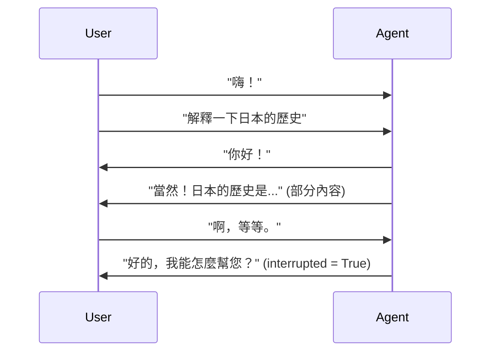
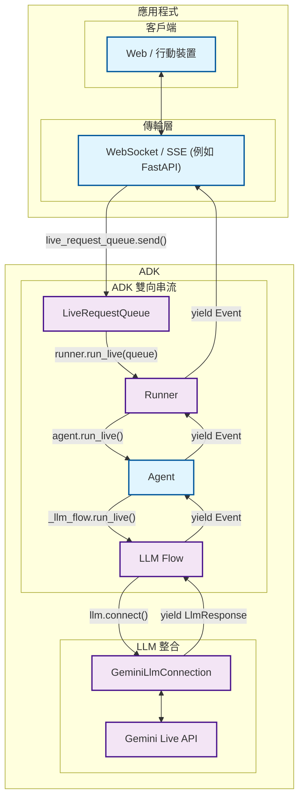

# ADK 雙向串流開發指南：第 1 部分 - 簡介

歡迎來到使用[代理程式開發套件 (ADK)](https://google.github.io/adk-docs/) 的雙向串流世界。本文將改變您對 AI 代理程式通訊的理解，從傳統的請求-回應模式轉變為動態、即時的對話，感覺就像與真人交談一樣自然。

想像一下，建立一個 AI 助理，它不僅僅是等您說完話才回應，而是積極聆聽，並在您突然有想法時可以中斷它的句子。想像一下，建立能夠同時處理音訊、視訊和文字的客戶支援機器人，同時在整個對話中保持上下文。這就是雙向串流的力量，而 ADK 讓每位開發人員都能使用它。

## 1.1 什麼是雙向串流？

雙向串流 (Bidi-streaming) 代表了與傳統 AI 互動的根本性轉變。它不再是僵化的「提問-等待」模式，而是實現了**即時、雙向的通訊**，人類和 AI 都可以同時說話、聆聽和回應。這創造了自然、類似人類的對話，具有即時的回應和革命性的中斷正在進行的互動的能力。

想想寄送電子郵件和打電話之間的區別。傳統的 AI 互動就像電子郵件——您傳送一則完整的訊息，等待一個完整的回應，然後再傳送另一則完整的訊息。雙向串流就像打電話——流暢、自然，能夠在即時中斷、澄清和回應。

### 主要特性

這些特性將雙向串流與傳統的 AI 互動區分開來，並使其在創造引人入勝的使用者體驗方面具有獨特的強大功能：

- **雙向通訊**：連續的資料交換，無需等待完整的回應。使用者和 AI 任何一方都可以在您仍在說話時就開始回應您問題的前幾個字，創造出真正具有對話性而非交易性的體驗。

- **回應式中斷**：對於自然的使用者體驗來說，這或許是最重要的功能——使用者可以在代理程式回應中途用新的輸入中斷它，就像在人類對話中一樣。如果 AI 正在解釋量子物理學，而您突然問「等等，電子是什麼？」，AI 會立即停止並回答您的問題。

- **最適合多模態**：同時支援文字、音訊和視訊輸入，創造出豐富、自然的互動。使用者可以在展示文件的同時說話，在語音通話期間輸入後續問題，或在不失去上下文的情況下無縫切換通訊模式。



### 與其他串流類型的差異

了解雙向串流與其他方法的不同之處，對於理解其獨特價值至關重要。串流領域包括幾種不同的模式，每種模式都適用於不同的使用案例：

!!! info "串流類型比較"

    **雙向串流**與其他串流方法有根本的不同：

    - **伺服器端串流**：從伺服器到客戶端的單向資料流。就像觀看即時視訊串流一樣——您會收到連續的資料，但無法與之即時互動。適用於儀表板或即時摘要，但不適用於對話。

    - **權杖級串流**：無中斷的循序文字權杖傳遞。AI 會逐字產生回應，但您必須等待完成後才能傳送新的輸入。就像看著某人即時輸入訊息一樣——您可以看到它正在形成，但無法中斷。

    - **雙向串流**：具有中斷支援的完全雙向通訊。真正的對話式 AI，雙方都可以同時說話、聆聽和回應。這就是實現自然對話的原因，您可以在對話中途進行中斷、澄清或更改主題。

### 實際應用

雙向串流透過使代理程式能夠以類似人類的回應能力和智慧運作，徹底改變了代理程式 AI 應用。這些應用程式展示了串流如何將靜態的 AI 互動轉變為動態的、由代理程式驅動的體驗，感覺真正智慧且主動。

在 [Shopper's Concierge 示範](https://www.youtube.com/watch?v=LwHPYyw7u6U) 的影片中，多模態、雙向串流功能透過實現更快、更直觀的購物體驗，顯著改善了電子商務的使用者體驗。對話式理解和快速、並行化搜尋的結合，最終實現了虛擬試穿等先進功能，提高了購買者的信心並減少了線上購物的摩擦。

<div class="video-grid">
  <div class="video-item">
    <div class="video-container">
      <iframe src="https://www.youtube-nocookie.com/embed/LwHPYyw7u6U?si=xxIEhnKBapzQA6VV" title="購物禮賓員" frameborder="0" allow="accelerometer; autoplay; clipboard-write; encrypted-media; gyroscope; picture-in-picture; web-share" referrerpolicy="strict-origin-when-cross-origin" allowfullscreen></iframe>
    </div>
  </div>
</div>

此外，您可以想到許多雙向串流可能的實際應用：

1. **客戶服務與聯絡中心**：這是最直接的應用。該技術可以建立遠超傳統聊天機器人的複雜虛擬代理程式。

    - **使用案例**：一位顧客就瑕疵產品致電零售公司的支援熱線。
    - **多模態 (視訊)**：顧客可以說：「我的咖啡機底部在漏水，讓我給你看。」然後他們可以使用手機的相機即時串流問題的視訊。AI 代理程式可以使用其視覺功能來識別型號和具體的故障點。
    - **即時互動與中斷**：如果代理程式說：「好的，我正在為您的 X 型咖啡機處理退貨。」顧客可以中斷說：「不，等等，是 Y Pro 型。」代理程式可以立即糾正其路線，而無需重新開始對話。

1. **現場服務與技術協助**：在現場工作的技術人員可以使用免持、聲控的助理來獲得即時幫助。

    - **使用案例**：一位 HVAC 技術人員正在現場試圖診斷一台複雜的商用空調設備。
    - **多模態 (視訊與語音)**：技術人員佩戴智慧眼鏡或使用手機，可以將其視角串流給 AI 代理程式。他們可以問：「我聽到這台壓縮機發出奇怪的噪音。你能識別它並調出這個型號的診斷流程圖嗎？」
    - **即時互動**：代理程式可以逐步指導技術人員，技術人員可以隨時提出澄清問題或中斷，而無需放下手中的工具。

1. **醫療保健與遠距醫療**：代理程式可以作為病患掛號、分類和基本諮詢的第一個接觸點。

    - **使用案例**：一位病患使用供應商的應用程式就皮膚狀況進行初步諮詢。
    - **多模態 (視訊/影像)**：病患可以安全地分享皮疹的即時視訊或高解析度影像。AI 可以進行初步分析並提出澄清問題。

1. **金融服務與財富管理**：代理程式可以為客戶提供安全、互動且資料豐富的方式來管理他們的財務。

    - **使用案例**：一位客戶想要審查他們的投資組合並討論市場趨勢。
    - **多模態 (螢幕分享)**：代理程式可以分享其螢幕以顯示圖表、圖形和投資組合績效資料。客戶也可以分享他們的螢幕，指向一篇特定的新聞文章並問：「這件事對我的科技股有什麼潛在影響？」
    - **即時互動**：透過存取客戶的帳戶資料來分析其目前的投資組合配置。模擬潛在交易對投資組合風險狀況的影響。

## 1.2 ADK 雙向串流架構概觀

ADK 雙向串流架構使雙向 AI 對話感覺像人類對話一樣自然。該架構透過一個為低延遲和高吞吐量通訊而設計的複雜管線，與 Google 的 [Gemini Live API](https://ai.google.dev/gemini-api/docs/live) 無縫整合。

該系統處理即時串流所需的複雜協調——管理多個並行資料流、優雅地處理中斷、同時處理多模態輸入，以及在動態互動中維護對話狀態。ADK 雙向串流將這種複雜性抽象為簡單、直觀的 API，開發人員無需了解串流協定或 AI 模型通訊模式的複雜細節即可使用。

### 高階架構



| 開發人員提供： | ADK 提供： | Gemini 提供： |
|:----------------------------|:------------------|:------------------------------|
| **Web / 行動裝置**：使用者與之互動的前端應用程式，處理 UI/UX、使用者輸入擷取和回應顯示<br><br>**[WebSocket](https://developer.mozilla.org/en-US/docs/Web/API/WebSocket) / [SSE](https://developer.mozilla.org/en-US/docs/Web/API/Server-sent_events) 伺服器**：即時通訊伺服器 (例如 [FastAPI](https://fastapi.tiangolo.com/))，管理客戶端連線、處理串流協定，並在客戶端和 ADK 之間路由訊息<br><br>**代理程式**：根據您的應用程式需求量身訂做的自訂 AI 代理程式定義，具有特定的指令、工具和行為 | **[LiveRequestQueue](https://github.com/google/adk-python/blob/main/src/google/adk/agents/live_request_queue.py)**：訊息佇列，用於緩衝和排序傳入的使用者訊息 (文字內容、音訊 blob、控制信號)，以便代理程式有序處理<br><br>**[Runner](https://github.com/google/adk-python/blob/main/src/google/adk/runners.py)**：執行引擎，協調代理程式會話、管理對話狀態，並提供 `run_live()` 串流介面<br><br>**[LLM Flow](https://github.com/google/adk-python/blob/main/src/google/adk/flows/llm_flows/base_llm_flow.py)**：處理管線，處理串流對話邏輯、管理上下文，並與語言模型協調<br><br>**[GeminiLlmConnection](https://github.com/google/adk-python/blob/main/src/google/adk/models/gemini_llm_connection.py)**：抽象層，將 ADK 的串流架構與 Gemini Live API 連接起來，處理協定轉換和連線管理 | **[Gemini Live API](https://ai.google.dev/gemini-api/docs/live)**：Google 的即時語言模型服務，處理串流輸入、產生回應、處理中斷、支援多模態內容 (文字、音訊、視訊)，並提供函式呼叫和上下文理解等進階 AI 功能 |

## 1.3 設定您的開發環境

現在您已經了解了 ADK 雙向串流架構的要點及其提供的價值，是時候親身體驗了。本節將準備您的開發環境，以便您可以開始建構前面章節中描述的串流代理程式和應用程式。

完成此設定後，您將擁有建立我們討論過的智慧語音助理、主動式客戶支援代理程式和多代理程式協作平台所需的一切。設定過程很簡單——ADK 處理複雜的串流基礎設施，因此您可以專注於建構代理程式的獨特功能，而不是與低階串流協定搏鬥。

### 安裝步驟

#### 1. 建立虛擬環境 (建議)

```bash
# 建立虛擬環境
python -m venv .venv

# 啟用虛擬環境
# macOS/Linux:
source .venv/bin/activate
# Windows CMD:
# .venv\Scripts\activate.bat
# Windows PowerShell:
# .venv\Scripts\Activate.ps1
```

#### 2. 安裝 ADK

在您的專案根目錄中建立一個 `requirements.txt` 檔案。請注意，`google-adk` 函式庫包含 FastAPI 和 uvicorn，您可以將其用作雙向串流應用程式的 Web 伺服器。

```txt
google-adk==1.3.0
python-dotenv>=1.0.0
```

安裝所有相依套件：

```bash
pip install -r requirements.txt
```

#### 3. 設定 SSL 憑證路徑 (僅限 macOS)

```bash
# 在 macOS 上正確處理 SSL 所需
export SSL_CERT_FILE=$(python -m certifi)
```

#### 4. 設定 API 金鑰

選擇您偏好的執行代理程式平台：

=== "Google AI Studio"

    1. 從 [Google AI Studio](https://aistudio.google.com/apikey) 取得 API 金鑰
    2. 在您的專案根目錄中建立一個 `.env` 檔案：

    ```env
    GOOGLE_GENAI_USE_VERTEXAI=FALSE
    GOOGLE_API_KEY=your_actual_api_key_here
    ```

=== "Google Cloud Vertex AI"

    1. 設定 [Google Cloud 專案](https://cloud.google.com/vertex-ai/generative-ai/docs/start/quickstarts/quickstart-multimodal#setup-gcp)
    2. 安裝並設定 [gcloud CLI](https://cloud.google.com/vertex-ai/generative-ai/docs/start/quickstarts/quickstart-multimodal#setup-local)
    3. 驗證：`gcloud auth login`
    4. [啟用 Vertex AI API](https://console.cloud.google.com/flows/enableapi?apiid=aiplatform.googleapis.com)
    5. 在您的專案根目錄中建立一個 `.env` 檔案：

    ```env
    GOOGLE_GENAI_USE_VERTEXAI=TRUE
    GOOGLE_CLOUD_PROJECT=your_actual_project_id
    GOOGLE_CLOUD_LOCATION=us-central1
    ```

#### 5. 建立環境設定腳本

我們將建立驗證腳本，以驗證您的安裝：

```bash
# 建立目錄結構
mkdir -p src/part1
```

建立 `src/part1/1-3-1_environment_setup.py`：

```python
#!/usr/bin/env python3
"""
第 1.3.1 部分：環境設定驗證
用於驗證 ADK 串流環境設定的綜合腳本。
"""

import os
import sys
from pathlib import Path
from dotenv import load_dotenv

def validate_environment():
    """驗證 ADK 串流環境設定。"""

    print("🔧 ADK 串流環境驗證")
    print("=" * 45)

    # 載入環境變數
    env_path = Path(__file__).parent.parent.parent / '.env'
    if env_path.exists():
        load_dotenv(env_path)
        print(f"✓ 環境檔案已載入：{env_path}")
    else:
        print(f"❌ 找不到環境檔案：{env_path}")
        return False

    # 檢查 Python 版本
    python_version = sys.version_info
    if python_version >= (3, 8):
        print(f"✓ Python 版本：{python_version.major}.{python_version.minor}.{python_version.micro}")
    else:
        print(f"❌ Python 版本 {python_version.major}.{python_version.minor} - 需要 3.8+")
        return False

    # 測試 ADK 安裝
    try:
        import google.adk
        print(f"✓ ADK 匯入成功")

        # 如果可用，嘗試取得版本
        try:
            from google.adk.version import __version__
            print(f"✓ ADK 版本：{__version__}")
        except:
            print("ℹ️ ADK 版本資訊不可用")

    except ImportError as e:
        print(f"❌ ADK 匯入失敗：{e}")
        return False

    # 檢查必要的匯入
    essential_imports = [
        ('google.adk.agents', 'Agent, LiveRequestQueue'),
        ('google.adk.runners', 'InMemoryRunner'),
        ('google.genai.types', 'Content, Part, Blob'),
    ]

    for module, components in essential_imports:
        try:
            __import__(module)
            print(f"✓ 匯入：{module}")
        except ImportError as e:
            print(f"❌ 匯入失敗：{module} - {e}")
            return False

    # 驗證環境變數
    env_checks = [
        ('GOOGLE_GENAI_USE_VERTEXAI', '平台設定'),
        ('GOOGLE_API_KEY', 'API 驗證'),
    ]

    for env_var, description in env_checks:
        value = os.getenv(env_var)
        if value:
            # 為安全起見，遮罩 API 金鑰
            display_value = value if env_var != 'GOOGLE_API_KEY' else f"{value[:10]}..."
            print(f"✓ {description}：{display_value}")
        else:
            print(f"❌ 缺少：{env_var} ({description})")
            return False

    # 測試基本的 ADK 功能
    try:
        from google.adk.agents import LiveRequestQueue
        from google.genai.types import Content, Part

        # 建立測試佇列
        queue = LiveRequestQueue()
        test_content = Content(parts=[Part(text="測試訊息")])
        queue.send_content(test_content)
        queue.close()

        print("✓ 基本 ADK 功能測試通過")

    except Exception as e:
        print(f"❌ ADK 功能測試失敗：{e}")
        return False

    print("\n🎉 環境驗證成功！")
    print("\n後續步驟：")
    print("• 在 src/agents/ 中開始建構您的串流代理程式")
    print("• 在 src/tools/ 中建立自訂工具")
    print("• 在 src/utils/ 中新增公用程式函式")
    print("• 使用第 3 部分的範例進行測試")

    return True

def main():
    """執行環境驗證。"""

    try:
        success = validate_environment()
        sys.exit(0 if success else 1)

    except KeyboardInterrupt:
        print("\n\n⚠️ 使用者中斷驗證")
        sys.exit(1)
    except Exception as e:
        print(f"\n❌ 未預期的錯誤：{e}")
        sys.exit(1)

if __name__ == "__main__":
    main()
```

### 專案結構

現在您的串流專案應該具有以下結構：

```text
your-streaming-project/
├── .env                              # 環境變數 (API 金鑰)
├── requirements.txt                 # Python 相依套件
└── src/
    └── part1/
        └── 1-3-1_environment_setup.py  # 環境驗證腳本
```

### 執行它

使用我們完整的環境設定腳本來確保一切都已正確設定：

```bash
python src/part1/1-3-1_environment_setup.py
```

!!! example "預期輸出"

    當您執行驗證腳本時，您應該會看到類似以下的輸出：

    ```
    🔧 ADK 串流環境驗證
    =============================================
    ✓ 環境檔案已載入：/path/to/your-streaming-project/.env
    ✓ Python 版本：3.12.8
    ✓ ADK 匯入成功
    ✓ ADK 版本：1.3.0
    ✓ 匯入：google.adk.agents
    ✓ 匯入：google.adk.runners
    ✓ 匯入：google.genai.types
    ✓ 平台設定：FALSE
    ✓ API 驗證：AIzaSyAolZ...
    ✓ 基本 ADK 功能測試通過

    🎉 環境驗證成功！
    ```

    這個綜合驗證腳本會檢查：

    - ADK 安裝和版本
    - 必要的環境變數
    - API 金鑰驗證
    - 基本匯入驗證

### 後續步驟

設定好您的環境後，您就可以深入了解核心串流 API 了。在下一部分（即將推出）中，您將學習：

- **LiveRequestQueue**：雙向通訊的核心
- **run_live() 方法**：啟動串流會話
- **事件處理**：處理即時回應
- **Gemini Live API**：直接整合模式
