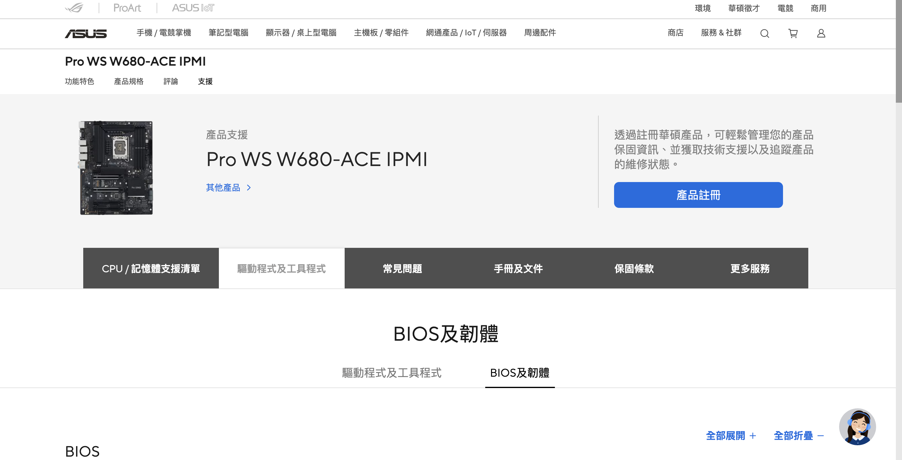

# Pro WS W680-ACE IPMI 手冊及文件

## 設置筆記

- [KVM 設置筆記](ipmi-kvm/kvm-setup.md)

- [Proxmox 設置筆記](ipmi-kvm/proxmox-setup.md)

## Markdown 文件 (PDF 轉換)

- [BIOS 使用手冊](bios-manual.md)

- [ASMB10-iKVM 遠端管理使用手冊](ikvm-manual.md)

- [IPMI 使用手冊](ipmi-manual.md)

## Proxmox 設置教學 Repository

- [Proxmox 設置教學 Repository](https://github.com/detectviz/proxmox-guide)

## 韌體 BIOS 更新

- [網址](https://www.asus.com/tw/motherboards-components/motherboards/workstation/pro-ws-w680-ace-ipmi/helpdesk_manual?model2Name=Pro-WS-W680-ACE-IPMI)

## PDF 文件

1. Pro WS W680-ACE

- [Pro WS W680-ACE IPMI BIOS MANUAL ( 繁體中文版 )](pdf/Pro_WS_W680-ACE_IPMI_BIOS_MANUAL_TC.pdf)

- [Pro WS W680-ACE / Pro WS W680-ACE IPMI 繁體中文版使用手冊](pdf/T21247_Pro_WS_W680-ACE_UM_WEB.pdf)

2. ASMB10-iKVM

- [ASMB10-iKVM 手冊網址](https://www.asus.com/tw/supportonly/asmb10-ikvm/helpdesk_manual)

- [ASMB10-iKVM 繁體中文版遠端管理卡使用手冊](pdf/T18037_ASMB10-iKVM_WEB.pdf)
